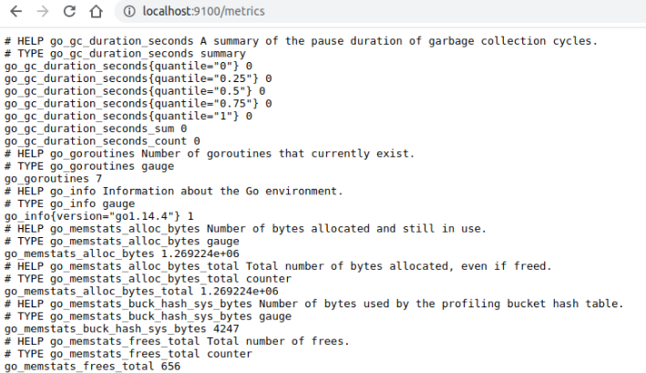

**1.На лекции мы познакомились с node_exporter. В демонстрации его исполняемый файл запускался в background. 
Этого достаточно для демо, но не для настоящей production-системы, где процессы должны находиться под внешним управлением. 
Используя знания из лекции по systemd, создайте самостоятельно простой unit-файл для node_exporter:<br />**
  * поместите его в автозагрузку,<br />
  * предусмотрите возможность добавления опций к запускаемому процессу через внешний файл (посмотрите, например, на systemctl cat cron),<br />
  * удостоверьтесь, что с помощью systemctl процесс корректно стартует, завершается, а после перезагрузки автоматически поднимается.<br />

<em>Решение:<em><br />
>***Установлено, порт  9100 проброшен на хостовую машину:<br />***



>***Сервис стартует и перезапускается корректно<br />***
1.Проверка после перезапуска работы процесса<br />
2.Остановка<br />
3.Проверка работы процесса<br />
4.Запуск процесса <br />
5.Проверка работы процесса<br /><br />
>```vagrant@vagrant:~$``` ps -e | grep node_exporter  <br /> 
   1375 ?        00:00:00 node_exporter<br />
```vagrant@vagrant:~$``` systemctl stop node_exporter<br />
==== AUTHENTICATING FOR org.freedesktop.systemd1.manage-units ===<br />
Authentication is required to stop 'node_exporter.service'.<br />
Authenticating as: vagrant,,, (vagrant)<br />
Password: <br />
==== AUTHENTICATION COMPLETE ===<br />
```vagrant@vagrant:~$``` ps -e | grep node_exporter<br />
```vagrant@vagrant:~$``` systemctl start node_exporter<br />
==== AUTHENTICATING FOR org.freedesktop.systemd1.manage-units ===<br />
Authentication is required to start 'node_exporter.service'.<br />
Authenticating as: vagrant,,, (vagrant)<br />
Password: <br />
==== AUTHENTICATION COMPLETE ===<br />
```vagrant@vagrant:~$``` ps -e | grep node_exporter<br />
   1420 ?        00:00:00 node_exporter<br />
```vagrant@vagrant:~$```
> ---
>**Прописан конфигруационный файл:<br />**
```vagrant@vagrant:/etc/systemd/system$``` cat /etc/systemd/system/node_exporter.service<br /><br />
[Unit]<br />
Description=Node Exporter<br /><br />
[Service]<br />
ExecStart=/opt/node_exporter/node_exporter<br />
EnvironmentFile=/etc/default/node_exporter<br /><br />
[Install]<br />
WantedBy=default.target
>---
>***При перезапуске переменная окружения выставляется:***<br />
```vagrant@vagrant:/etc/systemd/system$``` sudo cat /proc/1809/environ<br />
LANG=en_US.UTF-8LANGUAGE=en_US:PATH=/usr/local/sbin:/usr/local/bin:/usr/sbin:/usr/bin:/sbin:/bin:/snap/bin<br />
INVOCATION_ID=0fcb24d52895405c875cbb9cbc28d3ffJOURNAL_STREAM=9:35758MYVAR=some_value<br />

**2. Ознакомьтесь с опциями node_exporter и выводом ```/metrics``` по-умолчанию. Приведите несколько опций, которые вы бы 
выбрали для базового мониторинга хоста по CPU, памяти, диску и сети.**<br />
<em>Решение:<em><br />
>***CPU:<br />***
    node_cpu_seconds_total{cpu="0",mode="idle"} 2238.49<br />
    node_cpu_seconds_total{cpu="0",mode="system"} 16.72<br />
    node_cpu_seconds_total{cpu="0",mode="user"} 6.86<br />
    process_cpu_seconds_total<br /><br />
***Memory:<br />***
    node_memory_MemAvailable_bytes <br />
    node_memory_MemFree_bytes<br /><br />
***Disk(если несколько дисков то для каждого):<br />***
    node_disk_io_time_seconds_total{device="sda"} <br />
    node_disk_read_bytes_total{device="sda"} <br />
    node_disk_read_time_seconds_total{device="sda"} <br />
    node_disk_write_time_seconds_total{device="sda"}<br /><br />
***Network(так же для каждого активного адаптера):<br />***
    node_network_receive_errs_total{device="eth0"} <br />
    node_network_receive_bytes_total{device="eth0"} <br />
    node_network_transmit_bytes_total{device="eth0"}<br />
    node_network_transmit_errs_total{device="eth0"}<br />

3. Установите в свою виртуальную машину [Netdata](https://github.com/netdata/netdata). 
Воспользуйтесь [готовыми пакетами](https://packagecloud.io/netdata/netdata/install) для установки (`sudo apt install -y netdata`).
После успешной установки:
    * в конфигурационном файле `/etc/netdata/netdata.conf` в секции [web] замените значение с localhost на `bind to = 0.0.0.0`,
    * добавьте в Vagrantfile проброс порта Netdata на свой локальный компьютер и сделайте `vagrant reload`:

    ```bash
    config.vm.network "forwarded_port", guest: 19999, host: 19999
    ```

    После успешной перезагрузки в браузере *на своем ПК* (не в виртуальной машине) вы должны суметь зайти на `localhost:19999`. Ознакомьтесь с метриками, которые по умолчанию собираются Netdata и с комментариями, которые даны к этим метрикам.

<em>Решение:<em><br />
>***Netdata установлена, но проброшен порт 9999, так как 19999 - занят на хостовой машине под локальный netdata***<br /><br /> 
**Информация с хостовой машины:**<br />
>```art@art Vagrant$ sudo lsof -i :19999```<br />
COMMAND   PID    USER   FD   TYPE  DEVICE SIZE/OFF NODE NAME<br />
netdata 50358 netdata    4u  IPv4 1003958      0t0  TCP localhost:19999 (LISTEN)<br /><br />
```art@art Vagrant$ sudo lsof -i :9999```<br />
COMMAND     PID USER   FD   TYPE  DEVICE SIZE/OFF NODE NAME<br />
chrome     4089 art   80u  IPv4 1112886      0t0  TCP localhost:38598->localhost:9999 (ESTABLISHED)<br />
VBoxHeadl 52075 art   21u  IPv4 1053297      0t0  TCP *:9999 (LISTEN)<br />
VBoxHeadl 52075 art   30u  IPv4 1113792      0t0  TCP localhost:9999->localhost:38598 (ESTABLISHED)<br /><br />
**Информация с vm машины:<br />**
```vagrant@vagrant:~$ sudo lsof -i :19999```<br />
COMMAND  PID    USER   FD   TYPE DEVICE SIZE/OFF NODE NAME<br />
netdata 1895 netdata    4u  IPv4  30971      0t0  TCP *:19999 (LISTEN)<br />
netdata 1895 netdata   55u  IPv4  31861      0t0  TCP vagrant:19999->_gateway:38598 (ESTABLISHED)<br />

**4.Можно ли по выводу ```dmesg``` понять, осознает ли ОС, что загружена не на настоящем оборудовании, а на системе виртуализации?**<br />
<em>Решение:<em><br />
>***Судя по выводу dmesg да, причем даже тип ВМ, так как есть соответсвующая строка: <br />***
    ```vagrant@vagrant:~$ dmesg |grep virtualiz```<br />
[    0.002781] CPU MTRRs all blank - virtualized system.<br />
[    0.077391] Booting paravirtualized kernel on KVM<br />
[    3.066571] systemd[1]: Detected virtualization oracle.<br /><br />
***Если сравнить с хостовой машиной то это становится очевидным:<br />***
```art@art Vagrant$ dmesg |grep virtualiz```<br />
[    0.041253] Booting paravirtualized kernel on bare hardware<br />
... on bare hardware - что означает на чистом железе.***<br />

**5.Как настроен ```sysctl fs.nr_open``` на системе по-умолчанию? Узнайте, что означает этот параметр. Какой другой 
существующий лимит не позволит достичь такого числа (`ulimit --help`)**<br />
<em>Решение:<em><br />
>`vagrant@vagrant:~$ /sbin/sysctl -n fs.nr_open`<br />
1048576<br />
Это максимальное число открытых дескрипторов для ядра (системы), для пользователя задать больше этого числа нельзя (если не менять).<br /> 
Число задается кратное 1024, в данном случае =1024*1024.<br />
Но макс.предел ОС можно посмотреть так :<br />
`vagrant@vagrant:~$ cat /proc/sys/fs/file-max`<br />
9223372036854775807<br />
`vagrant@vagrant:~$ ulimit -Sn`<br />
1024<br />
мягкий лимит (так же ulimit -n)на пользователя (может быть увеличен процессов в процессе работы)<br />
`vagrant@vagrant:~$ ulimit -Hn`<br />
1048576<br />
жесткий лимит на пользователя (не может быть увеличен, только уменьшен)<br />
Оба ulimit -n НЕ могут превысить системный fs.nr_open<br />

**6.Запустите любой долгоживущий процесс (не `ls`, который отработает мгновенно, а, например, `sleep 1h`) в отдельном 
неймспейсе процессов; покажите, что ваш процесс работает под PID 1 через `nsenter`. Для простоты работайте в данном 
задании под root (`sudo -i`). Под обычным пользователем требуются дополнительные опции (`--map-root-user`) и т.д.**<br />
<em>Решение:<em><br />
>`root@vagrant:~# ps -e |grep sleep`<br />
2020 pts/2    00:00:00 sleep<br />
`root@vagrant:~# nsenter --target 2020 --pid --mount`<br />
`root@vagrant:/# ps`<br />
    PID TTY          TIME CMD<br />
      2 pts/0    00:00:00 bash<br />
     11 pts/0    00:00:00 ps<br />

**7.Найдите информацию о том, что такое `:(){ :|:& };:`. Запустите эту команду в своей виртуальной машине Vagrant с 
Ubuntu 20.04 (это важно, поведение в других ОС не проверялось). Некоторое время все будет "плохо", после чего (минуты) – 
ОС должна стабилизироваться. Вызов `dmesg` расскажет, какой механизм помог автоматической стабилизации. 
Как настроен этот механизм по-умолчанию, и как изменить число процессов, которое можно создать в сессии?**<br />
<em>Решение:<em><br />
>***Из предыдущих лекций ясно что это функция внутри "{}", судя по всему с именем ":" , которая после опредения в строке запускает саму себя.<br />
Внутринности через поиск нагуглил, пораждает два фоновых процесса самой себя,<br />
получается этакое бинарное дерево плодящее процессы<br /><br />
А функционал судя по всему этот:<br />***
```[ 3099.973235] cgroup: fork rejected by pids controller in /user.slice/user-1000.slice/session-4.scope```<br />
```[ 3103.171819] cgroup: fork rejected by pids controller in /user.slice/user-1000.slice/session-11.scope```<br /><br />
***Судя по всему, система на основании этих файлов в пользовательской зоне ресурсов имеет определенное ограничение на создаваемые ресурсы<br />
и соответсвенно при превышении начинает блокировать создание числа<br /><br />
Если установить ```ulimit -u 50``` - число процессов будет ограниченно 50 для пользоователя.***<br />
