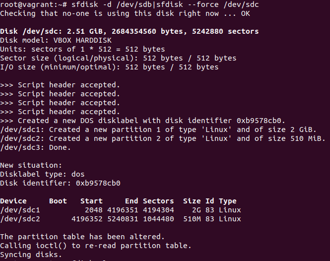
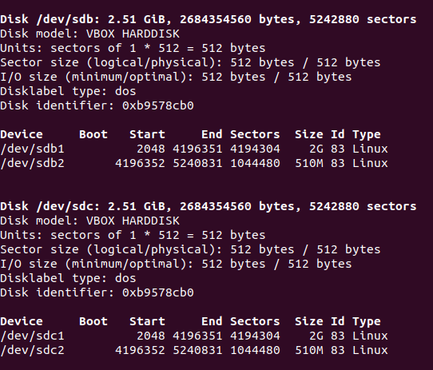
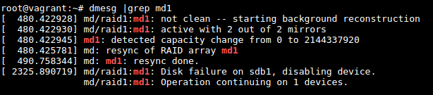

**1.Узнайте о `sparse` (разряженных) файлах.**<br />
<em>Решение:<em><br />
>*Просмотрел. В кратце - разряженные файлы это файлы которые пытаются использовать файловую систему более эффективно,<br /> 
> не позволяя ей занимать дисковое пространство, когда разделы файла пусты. Хорошее решение для использования в Торрентах*<br /><br />
>`vagrant@vagrant:~$ dd if=/dev/zero of=file-sparce bs=1 count=0 seek=2G`<br>
> `vagrant@vagrant:~$ truncate -s1G file-sparse2`<br />
> **По умолчанию обе команды создадут разряженные файлы с указ-ми размерами**<br /><br />
> `vagrant@vagrant:~$ cp --sparse=always 025.jpg 0251.jpg` - чтобы перевести файл в разряженный<br /> 
> `vagrant@vagrant:~$ dd if=/dev/zero of=01.jpg bs=1 count=0 seek=2G` - так же можем увеличить размет файла, добавив нули<br />

**2.Могут ли файлы, являющиеся жесткой ссылкой на один объект, иметь разные права доступа и владельца? Почему?**<br />
<em>Решение:<em><br />
>***Так как hardlink это ссылка на тот же самый файл и имеет тот же inode то права будут одни и теже.***<br /> 
*Например:*<br /><br />
vagrant@vagrant:~$ touch test_hl<br />
vagrant@vagrant:~$ ln test_hl test_link<br />
vagrant@vagrant:~$ ls -ilh<br />
total 4.0K<br />
526889 -rw-rw-r-- 2 vagrant vagrant  0 Feb 23 11:06 test_hl<br />
526889 -rw-rw-r-- 2 vagrant vagrant  0 Feb 23 11:06 test_link<br />
vagrant@vagrant:~$ chmod 0755 test_hl <br />
vagrant@vagrant:~$ ls -ilh<br />
total 4.0K<br />
526889 -rwxr-xr-x 2 vagrant vagrant  0 Feb 23 11:06 test_hl<br />
526889 -rwxr-xr-x 2 vagrant vagrant  0 Feb 23 11:06 test_link<br />
vagrant@vagrant:~$<br />

**3.Сделайте `vagrant destroy` на имеющийся инстанс Ubuntu. Замените содержимое Vagrantfile следующим:**<br />
```Vagrant.configure("2") do |config|
  config.vm.box = "bento/ubuntu-20.04"
  config.vm.provider :virtualbox do |vb|
    lvm_experiments_disk0_path = "/tmp/lvm_experiments_disk0.vmdk"
    lvm_experiments_disk1_path = "/tmp/lvm_experiments_disk1.vmdk"
    vb.customize ['createmedium', '--filename', lvm_experiments_disk0_path, '--size', 2560]
    vb.customize ['createmedium', '--filename', lvm_experiments_disk1_path, '--size', 2560]
    vb.customize ['storageattach', :id, '--storagectl', 'SATA Controller', '--port', 1, '--device', 0, '--type', 'hdd', '--medium', lvm_experiments_disk0_path]
    vb.customize ['storageattach', :id, '--storagectl', 'SATA Controller', '--port', 2, '--device', 0, '--type', 'hdd', '--medium', lvm_experiments_disk1_path]
  end
end
```
Данная конфигурация создаст новую виртуальную машину с двумя дополнительными неразмеченными дисками по 2.5 Гб.<br />
<em>Ответ:<em><br />
`root@vagrant:~$ lsblk`<br />
>NAME                 MAJ:MIN RM  SIZE RO TYPE MOUNTPOINT<br />
sda                         8:0    0   64G  0 disk<br /> 
├─sda1                      8:1    0    1M  0 part <br />
├─sda2                      8:2    0    1G  0 part /boot<br />
└─sda3                      8:3    0   63G  0 part <br />
  └─ubuntu--vg-ubuntu--lv 253:0    0 31.5G  0 lvm  /<br />
sdb                         8:16   0  2.5G  0 disk <br />
sdc                         8:32   0  2.5G  0 disk<br />

**4.Используя `fdisk`, разбейте первый диск на 2 раздела: 2 Гб, оставшееся пространство.**<br />
<em>Ответ:<em>
>```Device     Boot   Start     End Sectors  Size Id Type```<br />
```/dev/sdb1          2048 4196351 4194304    2G 83 Linux```<br />
```/dev/sdb2       4196352 5240831 1044480  510M 83 Linux```<br />

**5.Используя `sfdisk`, перенесите данную таблицу разделов на второй диск**<br />
<em>Ответ:<em><br />
<br />
**Результат:**<br />


####6.Соберите `mdadm` RAID1 на паре разделов 2 Гб.
<em>Ответ:<em>
>`root@vagrant:~# mdadm --create --verbose /dev/md1 -l 1 -n 2 /dev/sd{b1,c1}`<br />
mdadm: Note: this array has metadata at the start and<br />
    may not be suitable as a boot device.  If you plan to<br />
    store '/boot' on this device please ensure that<br />
    your boot-loader understands md/v1.x metadata, or use<br />
    --metadata=0.90<br />
mdadm: size set to 2094080K<br />
Continue creating array? y<br />
mdadm: Defaulting to version 1.2 metadata<br />
mdadm: array /dev/md1 started.<br />
`root@vagrant:~#`<br />

####7.Соберите `mdadm` RAID0 на второй паре маленьких разделов.
<em>Ответ:<em>
>`root@vagrant:~# mdadm --create --verbose /dev/md0 -l 1 -n 2 /dev/sd{b2,c2}`<br />
mdadm: Note: this array has metadata at the start and<br />
    may not be suitable as a boot device.  If you plan to<br />
    store '/boot' on this device please ensure that<br />
    your boot-loader understands md/v1.x metadata, or use<br />
    --metadata=0.90<br />
mdadm: size set to 522240K<br />
Continue creating array? н<br />
Continue creating array? (y/n) y<br />
mdadm: Defaulting to version 1.2 metadata<br />
mdadm: array /dev/md0 started.<br />
`root@vagrant:~#`<br />

####8.Создайте 2 независимых PV на получившихся md-устройствах.
<em>Ответ:<em><br />
>`root@vagrant:~# pvcreate /dev/md1 /dev/md0`<br />
  `Physical volume "/dev/md1" successfully created`.<br />
  `Physical volume "/dev/md0" successfully created`.<br />

####9.Создайте общую volume-group на этих двух PV.
<em>Ответ:<em><br />
>```root@vagrant:~# vgcreate vg1 /dev/md1 /dev/md0```<br />
  Volume group "vg1" successfully created<br /><br />
```root@vagrant:~# vgdisplay```<br />
  --- Volume group ---<br />
  VG Name               vgvagrant<br />
  System ID             <br />
  Format                lvm2<br />
  Metadata Areas        1<br />
  Metadata Sequence No  3<br />
  VG Access             read/write<br />
  VG Status             resizable<br />
  MAX LV                0<br />
  Cur LV                2<br />
  Open LV               2<br />
  Max PV                0<br />
  Cur PV                1<br />
  Act PV                1<br />
  VG Size               <63.50 GiB<br />
  PE Size               4.00 MiB<br />
  Total PE              16255<br />
  Alloc PE / Size       16255 / <63.50 GiB<br />
  Free  PE / Size       0 / 0   <br />
  VG UUID               5zL1A7-9ldG-J06F-1Pnu-m7we-mAzr-wBnOoF<br /><br />
  --- Volume group ---<br />
  VG Name               vg1<br />
  System ID             <br />
  Format                lvm2<br />
  Metadata Areas        2<br />
  Metadata Sequence No  1<br />
  VG Access             read/write<br />
  VG Status             resizable<br />
  MAX LV                0<br />
  Cur LV                0<br />
  Open LV               0<br />
  Max PV                0<br />
  Cur PV                2<br />
  Act PV                2<br />
  VG Size               2.49 GiB<br />
  PE Size               4.00 MiB<br />
  Total PE              638<br />
  Alloc PE / Size       0 / 0   <br />
  Free  PE / Size       638 / 2.49 GiB<br />
  VG UUID               tojQnc-yOx3-L2uF-35cS-agip-bkwo-5Sz4ol<br />

####10.Создайте LV размером 100 Мб, указав его расположение на PV с RAID0.
<em>Ответ:<em><br />
>`root@vagrant:~# lvcreate -L 100M vg1 /dev/md0`<br />
  Logical volume "lvol0" created.<br />
`root@vagrant:~# vgs`<br />
  VG        #PV #LV #SN Attr   VSize   VFree<br />
  vg1         2   1   0 wz--n-   2.49g 2.39g<br />
  vgvagrant   1   2   0 wz--n- <63.50g    0 <br />
`root@vagrant:~# lvs`<br />
  LV     VG        Attr       LSize   Pool Origin Data%  Meta%  Move Log Cpy%Sync Convert<br />
  lvol0  vg1       -wi-a----- 100.00m                          
  root   vgvagrant -wi-ao---- <62.54g                                                
  swap_1 vgvagrant -wi-ao---- 980.00m  

####11.Создайте `mkfs.ext4` ФС на получившемся LV.
<em>Ответ:<em><br />
>```root@vagrant:~# mkfs.ext4 /dev/vg1/lvol0```<br />
mke2fs 1.45.5 (07-Jan-2020)<br />
Creating filesystem with 25600 4k blocks and 25600 inodes<br /><br />
Allocating group tables: done                        
Writing inode tables: done                         
Creating journal (1024 blocks): done<br />
Writing superblocks and filesystem accounting information: done<br />

####12.Смонтируйте этот раздел в любую директорию, например, `/tmp/new`.
<em>Ответ:<em><br />
>`root@vagrant:~# mkdir /tmp/new`<br />
`root@vagrant:~# mount /dev/vg1/lvol0 /tmp/new`

####13.Поместите туда тестовый файл, например `wget https://mirror.yandex.ru/ubuntu/ls-lR.gz -O /tmp/new/test.gz`.
<em>Ответ:<em><br />
>`root@vagrant:~# wget https://mirror.yandex.ru/ubuntu/ls-lR.gz -O /tmp/new/test.gz`<br />
--2022-02-14 14:53:09--  https://mirror.yandex.ru/ubuntu/ls-lR.gz<br />
Resolving mirror.yandex.ru (mirror.yandex.ru)... 213.180.204.183, 2a02:6b8::183<br />
Connecting to mirror.yandex.ru (mirror.yandex.ru)|213.180.204.183|:443... connected.<br />
HTTP request sent, awaiting response... 200 OK<br />
Length: 20488555 (20M) [application/octet-stream]<br />
Saving to: ‘/tmp/new/test.gz’<br />
/tmp/new/test.gz     100%[=====================>]  19.54M  6.65MB/s    in 2.9s<br />
2022-02-14 14:53:12 (6.65 MB/s) - ‘/tmp/new/test.gz’ saved [20488555/20488555]<br />
`root@vagrant:~# ls -l /tmp/new`<br />
total 20012<br />
-rw-r--r-- 1 root root 20488555 Feb 14 14:17 test.gz<br />
`root@vagrant:~#` <br />

####14.Прикрепите вывод `lsblk`.
<em>Ответ:<em><br />
>`root@vagrant:~# lsblk`<br />
  NAME                 MAJ:MIN RM  SIZE RO TYPE  MOUNTPOINT<br />
  sda                    8:0    0   64G  0 disk  <br />
  ├─sda1                 8:1    0  512M  0 part  /boot/efi<br />
  ├─sda2                 8:2    0    1K  0 part  <br />
  └─sda5                 8:5    0 63.5G  0 part  <br />
    ├─vgvagrant-root   253:0    0 62.6G  0 lvm   /<br />
    └─vgvagrant-swap_1 253:1    0  980M  0 lvm   [SWAP]<br />
  sdb                    8:16   0  2.5G  0 disk  <br />
  ├─sdb1                 8:17   0    2G  0 part  <br />
  │ └─md1                9:1    0    2G  0 raid1 <br />
  └─sdb2                 8:18   0  511M  0 part  <br />
    └─md0                9:0    0  510M  0 raid1 <br />
      └─vg1-lvol0      253:2    0  100M  0 lvm   /tmp/new<br />
  sdc                    8:32   0  2.5G  0 disk  <br />
  ├─sdc1                 8:33   0    2G  0 part  <br />
  │ └─md1                9:1    0    2G  0 raid1 <br />
  └─sdc2                 8:34   0  511M  0 part  <br />
    └─md0                9:0    0  510M  0 raid1 <br />
      └─vg1-lvol0      253:2    0  100M  0 lvm   /tmp/new<br />

####15.Протестируйте целостность файла:
>`root@vagrant:~# gzip -t /tmp/new/test.gz`<br />
`root@vagrant:~# echo $?`<br />
`0`<br />

<em>Ответ:<em><br />
>`root@vagrant:~# gzip -t /tmp/new/test.gz && echo $?`<br />
`0`<br />

####16.Используя pvmove, переместите содержимое PV с RAID0 на RAID1.
<em>Ответ:<em><br />
>`root@vagrant:~# pvmove /dev/md0`<br />
  /dev/md0: Moved: 12.00%<br />
  /dev/md0: Moved: 100.00%<br />
`root@vagrant:~# lsblk`<br />
NAME                 MAJ:MIN RM  SIZE RO TYPE  MOUNTPOINT<br />
sda                    8:0    0   64G  0 disk  <br />
├─sda1                 8:1    0  512M  0 part  /boot/efi<br />
├─sda2                 8:2    0    1K  0 part  <br />
└─sda5                 8:5    0 63.5G  0 part  <br />
  ├─vgvagrant-root   253:0    0 62.6G  0 lvm   /<br />
  └─vgvagrant-swap_1 253:1    0  980M  0 lvm   [SWAP]<br />
sdb                    8:16   0  2.5G  0 disk  <br />
├─sdb1                 8:17   0    2G  0 part  <br />
│ └─md1                9:1    0    2G  0 raid1 <br />
│   └─vg1-lvol0      253:2    0  100M  0 lvm   /tmp/new<br />
└─sdb2                 8:18   0  511M  0 part  <br />
  └─md0                9:0    0  510M  0 raid1 <br />
sdc                    8:32   0  2.5G  0 disk  <br />
├─sdc1                 8:33   0    2G  0 part  <br />
│ └─md1                9:1    0    2G  0 raid1 <br />
│   └─vg1-lvol0      253:2    0  100M  0 lvm   /tmp/new<br />
└─sdc2                 8:34   0  511M  0 part  <br />
  └─md0                9:0    0  510M  0 raid1 <br />
`root@vagrant:~#` <br />

####17.Сделайте --fail на устройство в вашем RAID1 md.
<em>Ответ:<em><br />
>`root@vagrant:~# mdadm /dev/md1 --fail /dev/sdb1`<br />
mdadm: set /dev/sdb1 faulty in /dev/md1<br />
`root@vagrant:~# mdadm -D /dev/md1`<br />
/dev/md1:<br />
           Version : 1.2<br />
*******<br />
Consistency Policy : resync<br />
              Name : vagrant:1  (local to host vagrant)<br />
              UUID : 1aac0a29:<br />
`root@vagrant:~# mdadm -D /dev/md1`<br />
/dev/md1:<br />
           Version : 1.2<br />
0fa0dc73:082e1042:fe00b376<br />
            Events : 19<br />
    Number   Major   Minor   RaidDevice State<br />
       -       0        0        0      removed<br />
       1       8       33        1      active sync   /dev/sdc1<br />
       0       8       17        -      faulty   /dev/sdb1<br />

####18.Подтвердите выводом dmesg, что RAID1 работает в деградированном состоянии.
<em>Ответ:<em><br />
<br />

####19.Протестируйте целостность файла, несмотря на "сбойный" диск он должен продолжать быть доступен:
>`root@vagrant:~# gzip -t /tmp/new/test.gz`<br />
`root@vagrant:~# echo $?`<br />
`0`<br />

<em>Ответ:<em><br />
>`root@vagrant:~# gzip -t /tmp/new/test.gz && echo $?`<br />
`0`<br />

####20.Погасите тестовый хост, vagrant destroy.
<em>Ответ:<em><br />
>`art@art Vagrant$ vagrant destroy`<br />
    default: Are you sure you want to destroy the 'default' VM? [y/N] y<br />
==> default: Forcing shutdown of VM...<br />
==> default: Destroying VM and associated drives...<br />