####1.Работа c HTTP через телнет.
Подключитесь утилитой телнет к сайту stackoverflow.com telnet stackoverflow.com 80<br />
Отправьте HTTP запрос<br />
```GET /questions HTTP/1.0```<br />
```HOST: stackoverflow.com```<br />
```[press enter]```<br />
```[press enter]```<br />
В ответе укажите полученный HTTP код, что он означает?<br /><br />
<em>Ответ:<em><br />
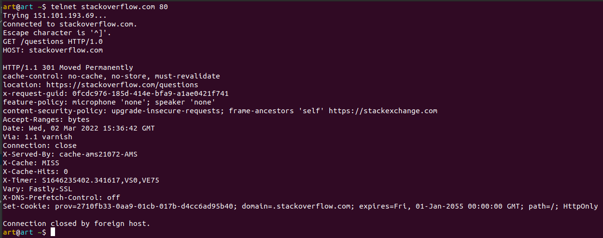<br />
>В ответ приходит версия протокола HTTP, код ответа - 301 Moved Permanently («перемещено навсегда»), параметры кеширования, 
> установленные куки. <br /> 
> Location пришел нам вместе с 300 котодом, он говорит о новом местоположении ресурса.<br />
> GUID запроса, CSP - для предотвращения межсайтовых сценариев. Accept-Ranges указывает единицу измерения, которая <br />
> может быть использована для определения диапазона чтения. VIA для отслеживания пересылки сообщений

####2.Повторите задание 1 в браузере, используя консоль разработчика F12.
-откройте вкладку Network<br />
-отправьте запрос http://stackoverflow.com <br />
-найдите первый ответ HTTP сервера, откройте вкладку Headers<br />
-укажите в ответе полученный HTTP код.<br />
-проверьте время загрузки страницы, какой запрос обрабатывался дольше всего?<br />
-приложите скриншот консоли браузера в ответ.<br /><br />
<em>Ответ:<em><br />
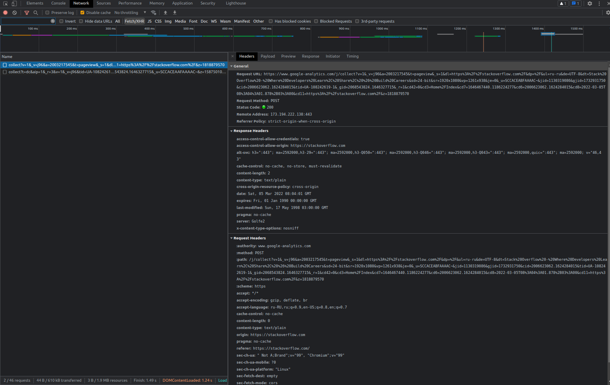<br />
>проверьте время загрузки страницы, какой запрос обрабатывался дольше всего?<br/><br />
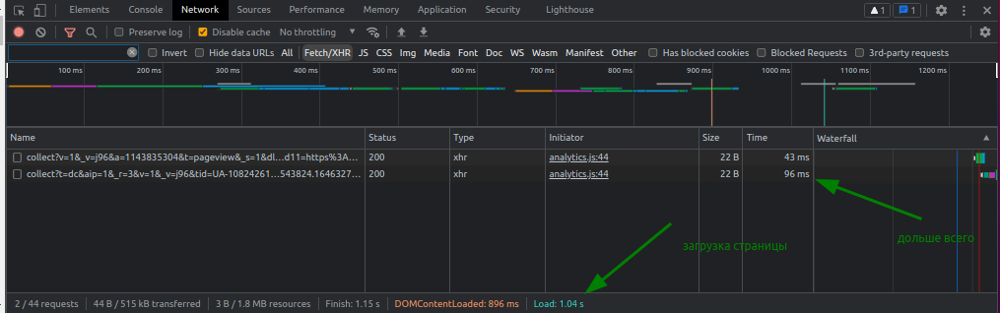<br />

####3.Какой IP адрес у вас в интернете?
<em>Ответ:<em><br />
>Можем определить через команду `ifconfig`, `ip`, `hostname`<br />
>Так получится узнать только IP выданный маршрутизатором, для компьютера, стоящего за маршрутизатором<br />

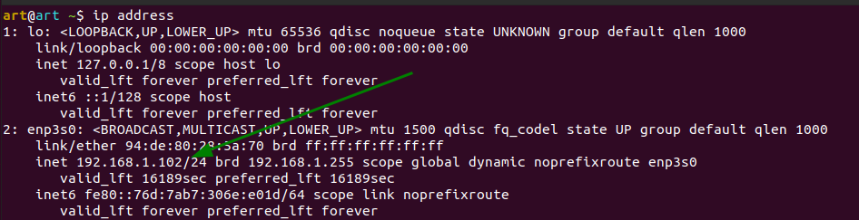<br />
> 192.168.1.102— это IP-адрес. 24 — это маска подсети, соответствующая маске 255.255.255.0.<br />
> Внешний ip адрес я узнал через спец сайт через команду `wget -qO- eth0.me` <br />
>`2.56.180.172`
####4.Какому провайдеру принадлежит ваш IP адрес? Какой автономной системе AS? Воспользуйтесь утилитой `whois`
<em>Ответ:<em><br />
>Можно через `whois 2.56.180.172`, для разнообразия провайдера узнал через команду `telnet whois.ripe.net 43` 
> указав свой внешний ip `2.56.180.172` получил:<br />

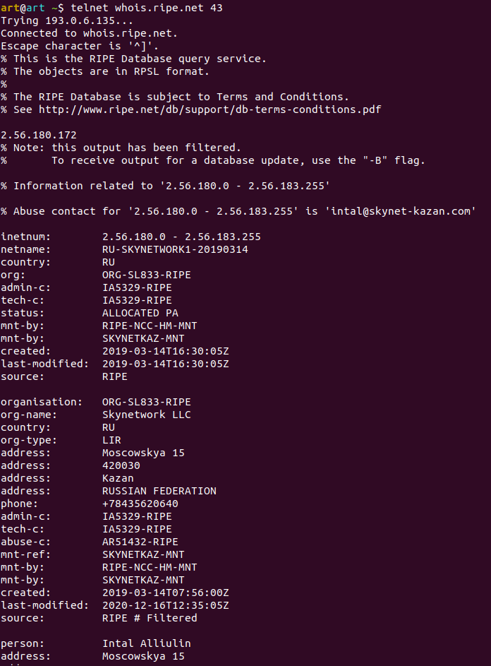<br />

>Какой автономной системе AS? Обращается к базе данных whois.radb.net

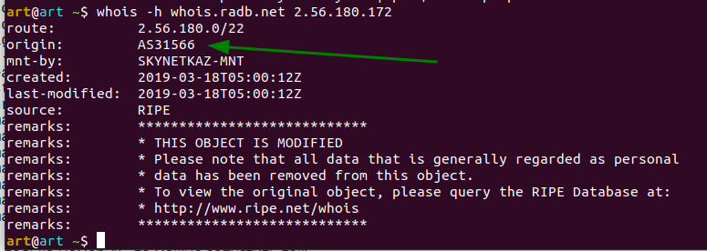<br />

####5.Через какие сети проходит пакет, отправленный с вашего компьютера на адрес 8.8.8.8? Через какие AS? Воспользуйтесь утилитой `traceroute`
<em>Ответ:<em><br />
>добавив ключ -A смог вывести AS на определеном маршрутизаторе, но возникла проблема после 9 хопа, узел перестал нам отвечать

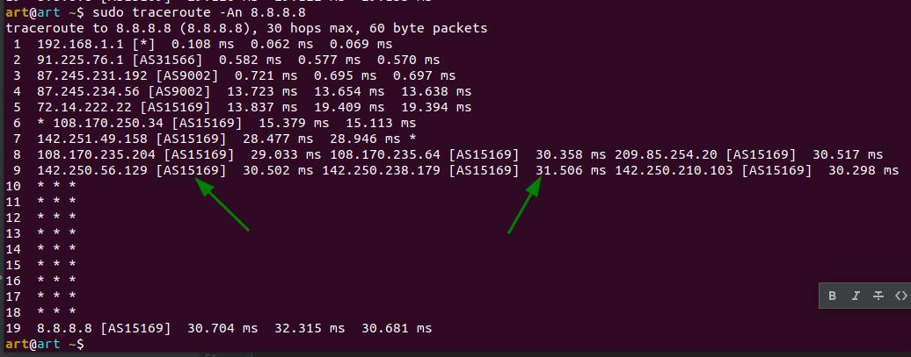<br />

####6.Повторите задание 5 в утилите `mtr`. На каком участке наибольшая задержка - delay?
<em>Ответ:<em><br />
>`mtr -n 8.8.8.8`

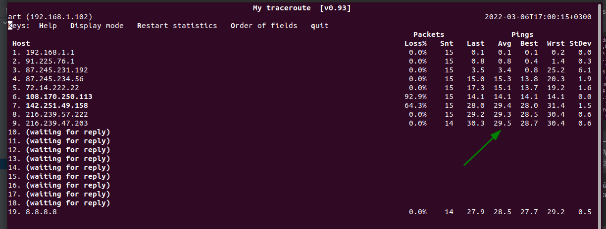<br />

####7.Какие DNS сервера отвечают за доменное имя dns.google? Какие A записи? воспользуйтесь утилитой `dig`
<em>Ответ:<em><br />

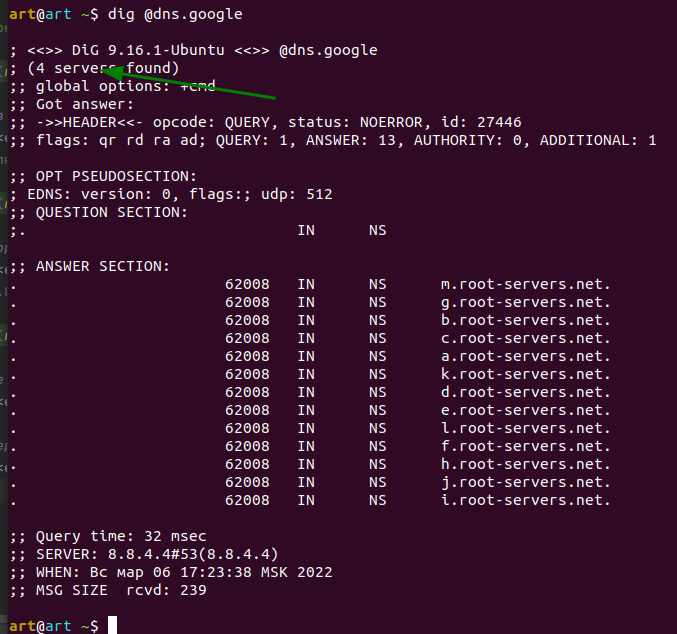<br />

>использую команду `dig +trace @8.8.8.8 gmail.com`

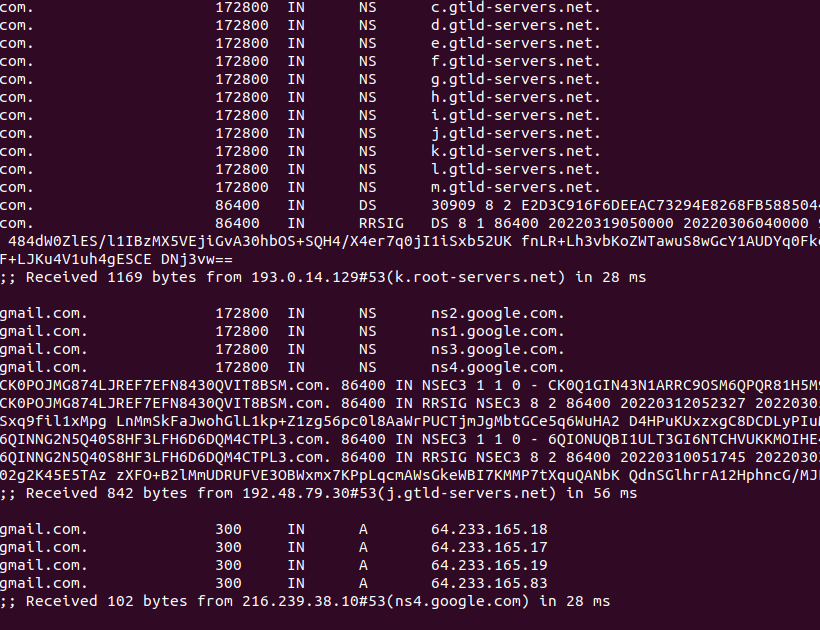<br />

####8.Проверьте PTR записи для IP адресов из задания 7. Какое доменное имя привязано к IP? воспользуйтесь утилитой `dig`
<em>Ответ:<em><br />

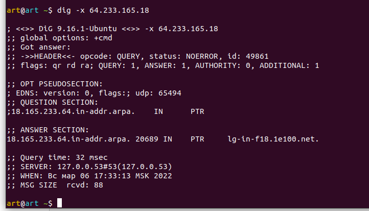<br />
