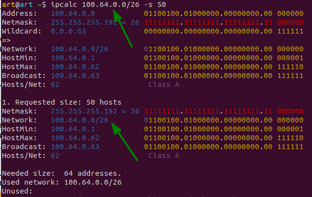

#### 1.Проверьте список доступных сетевых интерфейсов на вашем компьютере. Какие команды есть для этого в Linux и в Windows?
<em>Ответ:<em> 
>Вывести без лишней информации можно так (Linux), или можно так же использовать команду `ip -c -br li`:

 
>для Windows можно воспользоваться командой для PowerShell `Get-NetAdapter`

#### 2.Какой протокол используется для распознавания соседа по сетевому интерфейсу? Какой пакет и команды есть в Linux для этого?
<em>Ответ:<em> 
>протокол LLDP, установим пакет `apt install lldpd`, запустим `systemctl enable lldpd && systemctl start lldpd` 
> Чтобы посмотреть ближайщий коммутатор к которому я подлючен в сети через тот или иной интерфейс и получить данные - 
> воспользуемся коммандой `lldpctl`

#### 3.Какая технология используется для разделения L2 коммутатора на несколько виртуальных сетей? Какой пакет и команды есть в Linux для этого? Приведите пример конфига.
<em>Ответ:<em> 
> VLAN -  виртуальные локальные сети, виртуальное разделение коммутатора 
> Для работы установил пакет `vlan`, так же запустил модуль ядра `sudo modprobe 8021q` 
> Добавил в интерфейс с помощью команды `sudo ip link add link enp3s0 name enp3s0.100 type vlan id 100` 
> Добавил ip адрес в vlan интерфейс при помощи команды `sudo ip addr add 192.168.100.2/24 dev enp3s0.100` 
> И чтобы запустить `sudo ip link set up enp3s0` 
> и выведем`ip a` 

#### 4.Какие типы агрегации интерфейсов есть в Linux? Какие опции есть для балансировки нагрузки? Приведите пример конфига.
<em>Ответ:<em> 
>Типы LAG: 
>-статический (на Cisco mode on); 
>-динамический – LACP протокол (на Cisco mode active). 

>`mode=0 (balance-rr)` Этот режим используется по-умолчанию, если в настройках не указано другое 
> `mode=1 (active-backup)` При active-backup один интерфейс работает в активном режиме, остальные в ожидающем 
> `mode=2 (balance-xor)` Передача пакетов распределяется между объединенными интерфейсами по формуле 
> `mode=3 (broadcast)` Происходит передача во все объединенные интерфейсы, обеспечивая отказоустойчивость 
> `mode=4 (802.3ad)` Это динамическое объединение портов 
> `mode=5 (balance-tlb)` Адаптивная балансировка нагрузки 
> `mode=6 (balance-alb)` Адаптивная балансировка нагрузки (более совершенная) 

#### 5.Сколько IP адресов в сети с маской /29 ? Сколько /29 подсетей можно получить из сети с маской /24. Приведите несколько примеров /29 подсетей внутри сети 10.10.10.0/24
<em>Ответ:<em> 
>Всего адресов с маской 29 - 8, на хосты мы можем выделить 6. C маской 24 - адресов 256, 254 под хосты,  
> значит делим 256 на 8 и получаем количество подсетей с 29 маской в 32 сети  
vagrant@vagrant:~$ ipcalc -b --split 8 10.10.10.0/24 
Address:   10.10.10.0 
Netmask:   255.255.255.0 = 24 
Wildcard:  0.0.0.255 
=> 
Network:   10.10.10.0/24 
HostMin:   10.10.10.1 
HostMax:   10.10.10.254 
Broadcast: 10.10.10.255 
Hosts/Net: 254 Class A, Private Internet 
Requested size: 8 hosts 
Netmask:   255.255.255.248 = 29 
Network:   10.10.10.0/29 
HostMin:   10.10.10.1 
HostMax:   10.10.10.6 
Broadcast: 10.10.10.7 
Hosts/Net: 6                     Class A, Private Internet 

#### 6.Задача: вас попросили организовать стык между 2-мя организациями. Диапазоны 10.0.0.0/8, 172.16.0.0/12, 192.168.0.0/16 уже заняты. Из какой подсети допустимо взять частные IP адреса? Маску выберите из расчета максимум 40-50 хостов внутри подсети.
<em>Ответ:<em> 

#### 7.Как проверить ARP таблицу в Linux, Windows? Как очистить ARP кеш полностью? Как из ARP таблицы удалить только один нужный IP?
<em>Ответ:<em> 

>`arp –a` вывести записи ARP-таблицы  
`arp -d 192.168.1.1` удаляет запись, соответствующую хосту. 
`arp -d -a` удаляет все записи таблицы. 
`ip neigh flush all` эта команда для всех пунктов состояния задает failed. В дальнейшем ядро операционной системы удалит помеченные MAC адреса