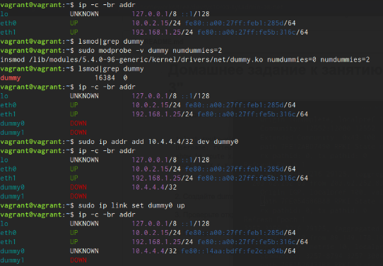
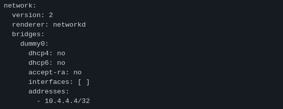
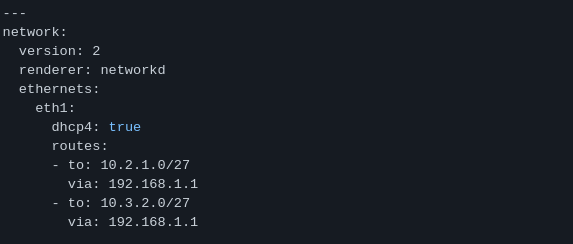
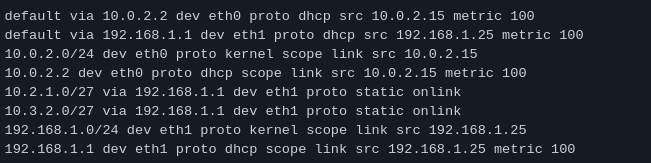

#### 1.Подключитесь к публичному маршрутизатору в интернет. Найдите маршрут к вашему публичному IP
```
telnet route-views.routeviews.org
Username: rviews
show ip route x.x.x.x/32
show bgp x.x.x.x/32
```
<em>Ответ:<em><br />


#### 2.Создайте dummy0 интерфейс в Ubuntu. Добавьте несколько статических маршрутов. Проверьте таблицу маршрутизации.

<em>Ответ:<em><br />



>Для того чтобы настройки сохранились после перезагрузки -> ведем команду и отредактируем .yaml <br /> 
`root@vagrant:~# echo "dummy" >> /etc/modules` <br/>
`root@vagrant:~# echo "options dummy numdummies=2" > /etc/modprobe.d/dummy.conf`<br/>
`root@vagrant:/etc/netplan# vim 60-dummy.yaml`<br/>



>Добавить статические маршруты:<br />
`root@vagrant:/etc/netplan# ip route add 10.2.1.0/27 via 192.168.1.1`<br />
`root@vagrant:/etc/netplan# ip route add 10.3.2.0/27 via 192.168.1.1`<br />
`root@vagrant:~# vim /etc/netplan/50-vagrant.yaml`<br />



>Посмотрим таблицу маршрутизации<br />
`root@vagrant:~# ip route`<br />



#### 3.Проверьте открытые TCP порты в Ubuntu, какие протоколы и приложения используют эти порты? Приведите несколько примеров.

<em>Ответ:<em><br />

>Проверяем открытые TCP порты:

```root@vagrant:~# ss  -ntlp```

```bash
State                Recv-Q               Send-Q                             Local Address:Port                                Peer Address:Port               Process                                                  
LISTEN               0                    4096                                   127.0.0.1:8125                                     0.0.0.0:*                   users:(("netdata",pid=630,fd=26))                       
LISTEN               0                    4096                                     0.0.0.0:19999                                    0.0.0.0:*                   users:(("netdata",pid=630,fd=4))                        
LISTEN               0                    4096                               127.0.0.53%lo:53                                       0.0.0.0:*                   users:(("systemd-resolve",pid=608,fd=13))               
LISTEN               0                    128                                      0.0.0.0:22                                       0.0.0.0:*                   users:(("sshd",pid=671,fd=3))                           
LISTEN               0                    4096                                           *:9100                                           *:*                   users:(("node_exporter",pid=634,fd=3))                  
LISTEN               0                    128                                         [::]:22                                          [::]:*                   users:(("sshd",pid=671,fd=4))            
```

>sshd: 22 порт<br />
netdata: 19999 порт<br />
node_exporter: 9100 порт<br />

#### 4.Проверьте используемые UDP сокеты в Ubuntu, какие протоколы и приложения используют эти порты?

<em>Ответ:<em><br />

>Проверяем используемые UDP сокеты:
```root@vagrant:~# ss  -nulp```

```bash
State                Recv-Q               Send-Q                                 Local Address:Port                             Peer Address:Port              Process                                                  
UNCONN               0                    0                                          127.0.0.1:8125                                  0.0.0.0:*                  users:(("netdata",pid=630,fd=25))                       
UNCONN               0                    0                                      127.0.0.53%lo:53                                    0.0.0.0:*                  users:(("systemd-resolve",pid=608,fd=12))               
UNCONN               0                    0                                  192.168.1.25%eth1:68                                    0.0.0.0:*                  users:(("systemd-network",pid=1876,fd=21))              
UNCONN               0                    0                                     10.0.2.15%eth0:68                                    0.0.0.0:*                  users:(("systemd-network",pid=1876,fd=23)) 
```

>systemd-resolve: 53 порт<br />
systemd-network: 68 порт<br />

#### 5.Используя diagrams.net, создайте L3 диаграмму вашей домашней сети или любой другой сети, с которой вы работали.

<em>Ответ:<em><br />

