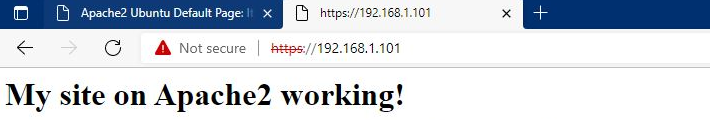
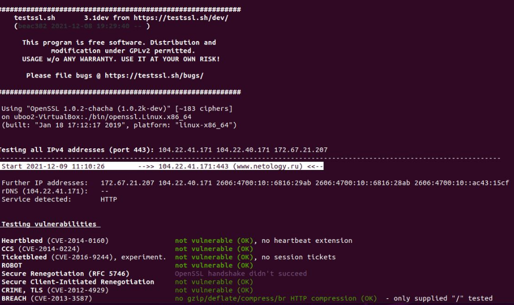
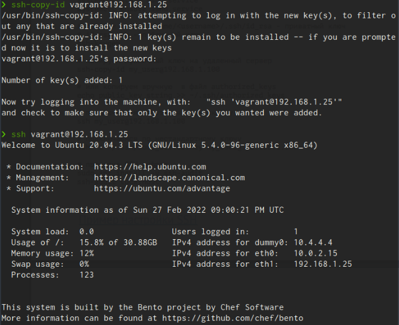
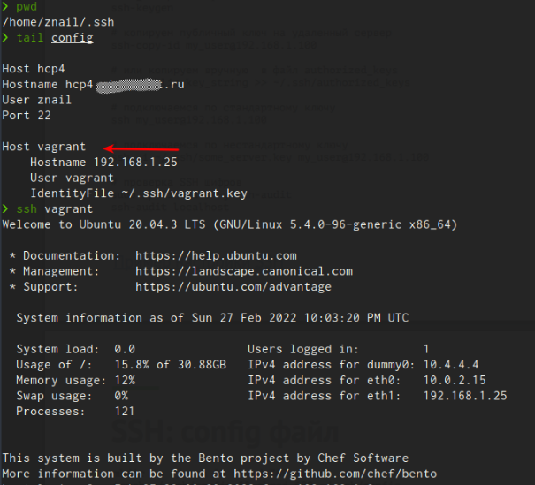
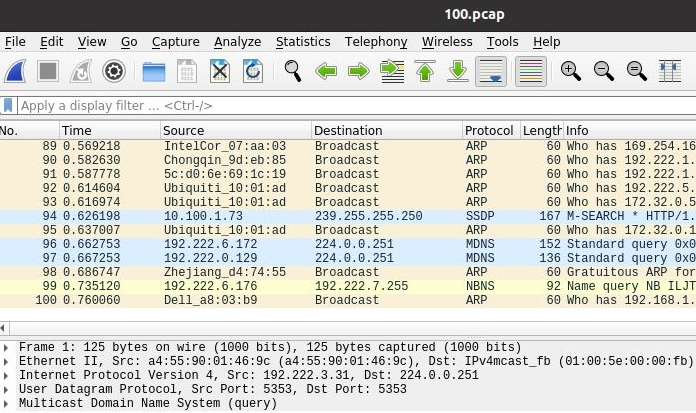

#### 1.Установите Bitwarden плагин для браузера. Зарегестрируйтесь и сохраните несколько паролей.

<em>Ответ:<em> 

#### 2.Установите Google authenticator на мобильный телефон. Настройте вход в Bitwarden акаунт через Google authenticator OTP.

<em>Ответ:<em> 

#### 3.Установите apache2, сгенерируйте самоподписанный сертификат, настройте тестовый сайт для работы по HTTPS.

<em>Ответ:<em> 

>Устанавливаем apache2 
`sudo apt-get update` 
`sudo apt install apache2` 

>включаем mod_ssl с помощью команды a2enmod: 
`sudo a2enmod ssl #включаем mod_ssl`

>Перезапуcкаем Apache, чтобы активировать модуль: 
`sudo systemctl restart apache2` 

>Создаем файлы ключей и сертификатов SSL с помощью команды openssl: 
>«\» само по себе в конце строки является средством объединения строк вместе. 

`sudo openssl req -x509 -nodes -days 36500 -newkey rsa:2048 \` 
`-keyout /etc/ssl/private/apache-selfsigned.key \` 
`-out /etc/ssl/certs/apache-selfsigned.crt \` 
`-subj "/C=RU/ST=Russia/L=Sakhalin/O=NetologyHW/OU=Org/CN=www.netologyHW.ru"` 

>генерировать конфиг файл можно на сайте https://ssl-config.mozilla.org 
`sudo nano /etc/apache2/sites-available/web1.conf` 

><VirtualHost *:443> 
 ServerName web1 
 DocumentRoot /var/www/web1 
 SSLEngine on 
 SSLCertificateFile /etc/ssl/certs/apache-selfsigned.crt 
 SSLCertificateKeyFile /etc/ssl/private/apache-selfsigned.key 
\</VirtualHost> 

`sudo mkdir /var/www/web1` 
`sudo nano /var/www/web1/index.html` 
>создаем, что будет отображатся на странице. 

<h1>My site on Apache2 working!</h1>

>Затем нам нужно включить файл конфигурации с помощью инструмента a2ensite: 
`sudo a2ensite web1.conf`  

>проверяем 
`sudo apache2ctl configtest` 
`sudo systemctl reload apache2` 

#### 4.Проверьте на TLS уязвимости произвольный сайт в интернете (кроме сайтов МВД, ФСБ, МинОбр, НацБанк, РосКосмос, РосАтом, РосНАНО и любых госкомпаний, объектов КИИ, ВПК ... и тому подобное).
<em>Ответ:<em> 

#### 5.Установите на Ubuntu ssh сервер, сгенерируйте новый приватный ключ. Скопируйте свой публичный ключ на другой сервер. Подключитесь к серверу по SSH-ключу.
<em>Ответ:<em> 

#### 6.Переименуйте файлы ключей из задания 5. Настройте файл конфигурации SSH клиента, так чтобы вход на удаленный сервер осуществлялся по имени сервера.
<em>Ответ:<em> 

#### 7.Соберите дамп трафика утилитой tcpdump в формате pcap, 100 пакетов. Откройте файл pcap в Wireshark.
<em>Ответ:<em> 

`sudo tcpdump -c 100 -w 100.pcap -i enp0s8` 
>tcpdump: listening on enp0s8, link-type EN10MB (Ethernet), capture size 262144 bytes 
100 packets captured 
125 packets received by filter 
0 packets dropped by kernel 

`sudo apt install wireshark` 
`sudo wireshark`

