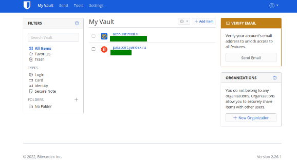
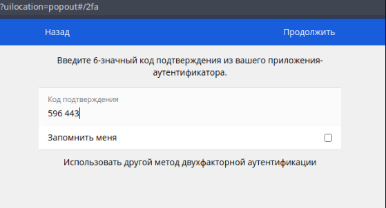

#### 1.Установите Bitwarden плагин для браузера. Зарегестрируйтесь и сохраните несколько паролей.

<em>Ответ:<em> 

#### 2.Установите Google authenticator на мобильный телефон. Настройте вход в Bitwarden акаунт через Google authenticator OTP.

<em>Ответ:<em> 

