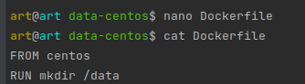
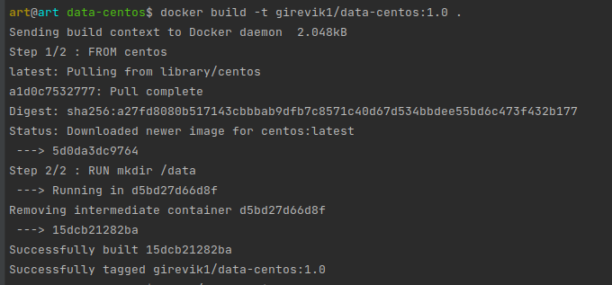
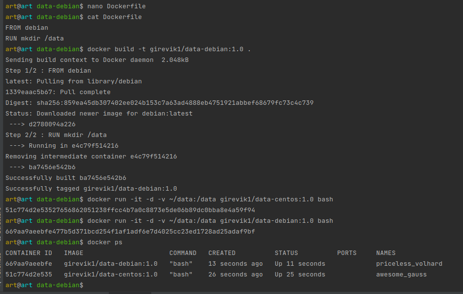
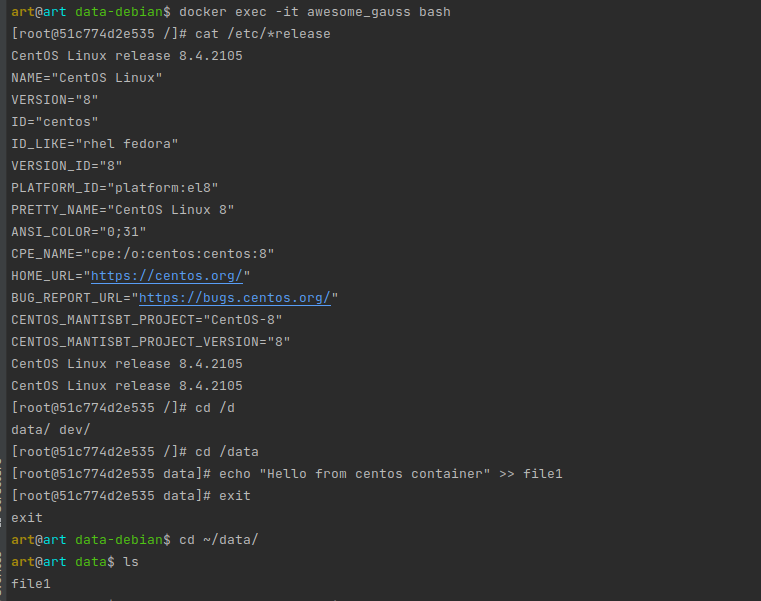
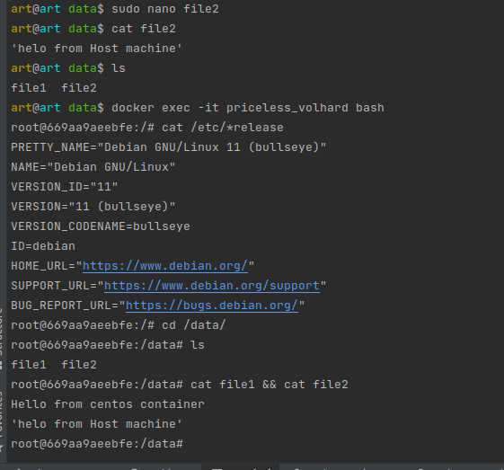

### Задача 1
Сценарий выполения задачи:
 - создайте свой репозиторий на https://hub.docker.com;
 - выберете любой образ, который содержит веб-сервер Nginx;
 - создайте свой fork образа;
 - реализуйте функциональность: запуск веб-сервера в фоне с индекс-страницей, содержащей HTML-код.

`Ответ:` 

 `UPD` Добавил COPY в Dockerfile. Скопировал index.php с локальной машины в контейнер
 https://hub.docker.com/r/girevik1/customubuntunginx  
 `docker pull girevik1/customubuntunginx:1.0` 
 `docker run -d -p 4444:80 name_container_or_id` 
И можем смотреть на порту 4444 наш html  
`localhost:4444`

### Задача 2
Посмотрите на сценарий ниже и ответьте на вопрос: "Подходит ли в этом сценарии использование Docker контейнеров или лучше подойдет виртуальная машина,
физическая машина? Может быть возможны разные варианты?"

Детально опишите и обоснуйте свой выбор.

`Ответ:` 
>`Высоконагруженное монолитное java веб-приложение;`
>
>Использование Docker контейнеров не подходит, т.к. Java-процессы, исполняемые внутри контейнеров Linux (среди них — docker, rkt, runC, lxcfs, и другие), ведут себя не так, как ожидается.

>`Nodejs веб-приложение;`
>
>Да, вполне можно использовать докер - быстро развернется с нужными библиотеками и будет готово к работе.

>`Мобильное приложение c версиями для Android и iOS;`
>
>Возможно использовать Docker контейнеры, это дает возможность разделять например различные модули по отдельным контейнерам в зависимости от моделей мобильных устройств с различным окружением.

>`Шина данных на базе Apache Kafka;`
>
>Возможно использовать Docker. Настройка Apache Kafka подразумевает предварительную настойку множества инструментов которые в различных дистирбутивах настраиваются и ведут себя по разному. 
> Создание контейнера сделает развертывание и перенос на другие системы более удобным и быстрым.

>`Elasticsearch кластер для реализации логирования продуктивного веб-приложения - три ноды elasticsearch, два logstash и две ноды kibana;`
>
>Рекомендуется использовать Docker, это облегчает процесс оркестрации служб и согласование конфигураций, обновления и технического обслуживания.

>`Мониторинг-стек на базе Prometheus и Grafana;`
>
>Возможно использование контейнеров Docker, это ускоряет процесс развертывания и масштабирования системы мониторинга, 
> когда например необходимо быстро подключить уже отлаженный мониторинг-стек к новым развертываемым проектам.

>`MongoDB, как основное хранилище данных для java-приложения;`
>
>Согласно официальной документации использовать MongoDB в Docker возможно. Но существующий community edition образ рекомендуют использвать только в среде разработки. 
>Для продакшен среды рекомендовано использование Enterprise версии с использование определенных инструкций.

>`Gitlab сервер для реализации CI/CD процессов и приватный (закрытый) Docker Registry.`
>
>Возможно использование Docker, это позволит добавлять новую функциональность быстрее и надежнее.

### Задача 3
`Ответ:` 

