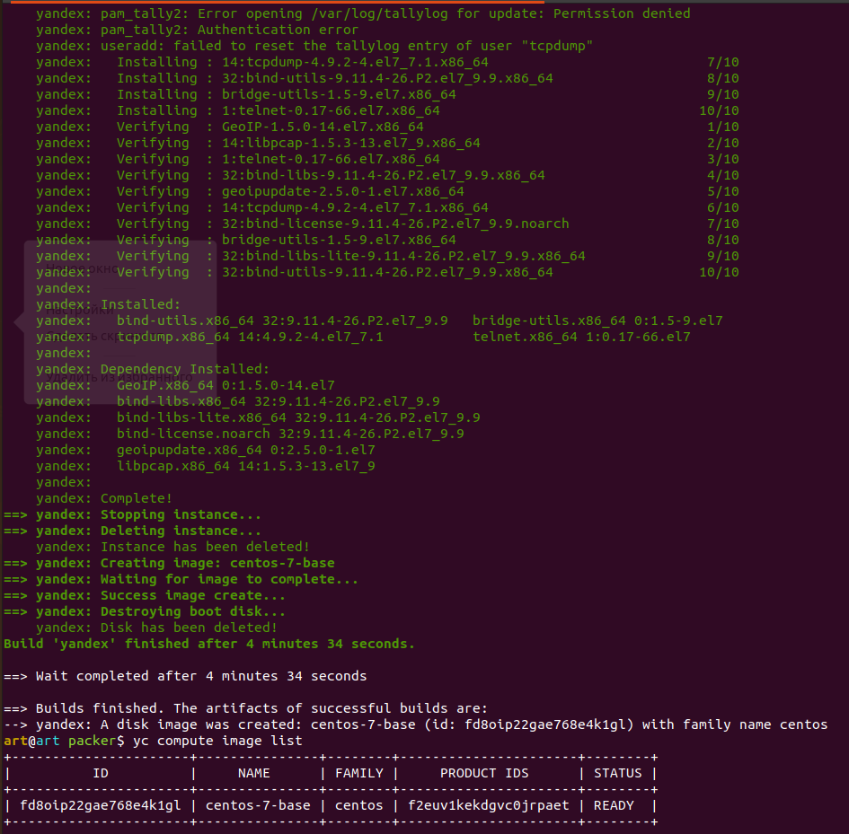
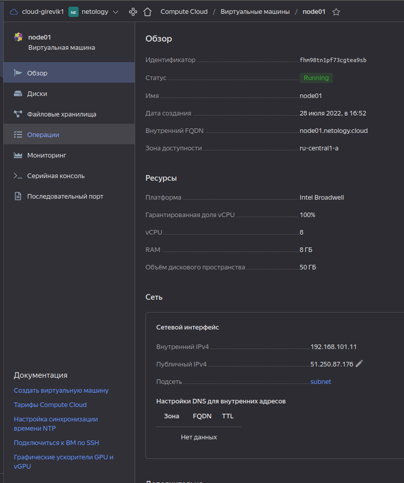
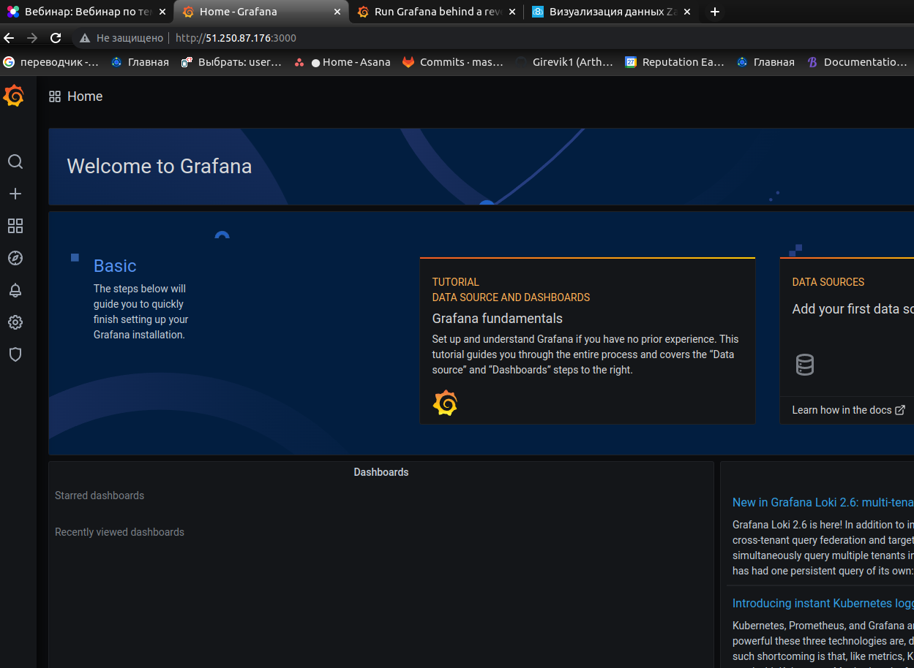

### Задача 1
Создать собственный образ операционной системы с помощью Packer. 

`Ответ:`

### Задача 2
Создать вашу первую виртуальную машину в Яндекс.Облаке.

`Ответ:`

### Задача 3
Создать ваш первый готовый к боевой эксплуатации компонент мониторинга, состоящий из стека микросервисов.

`Ответ:` 
Удачно открыл GRAFANA на 3000 порту. Но не смог определить почему данных не было, не было готовых дашбордов как на лекции (

