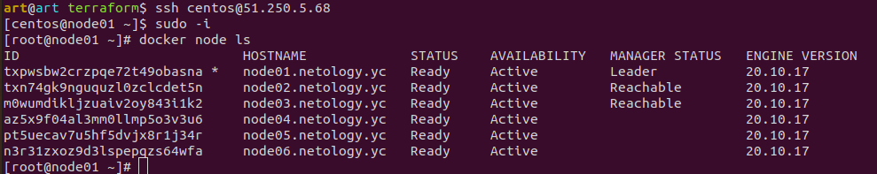
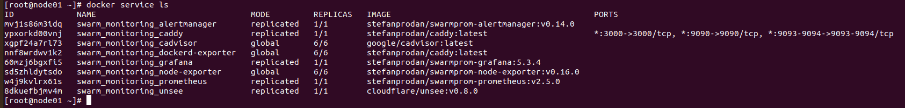

### Задача 1
Дайте письменые ответы на следующие вопросы:

- В чём отличие режимов работы сервисов в Docker Swarm кластере: replication и global?
- Какой алгоритм выбора лидера используется в Docker Swarm кластере?
- Что такое Overlay Network?

`Ответ:`

***Режим replication*** предполагает определенное, заданное количество реплик микросервисов, запускаемых в кластере, 
которое будет равномерно распределено по кластеру. 
***Режим global*** предполагает, что реплики микросервиса будут запущены на всех нодах кластера.
 В Docker Swarm **для выбора лидера** используется алгоритм поддержания распределенного консенсуса - Raft.

***Overlay Network*** - оверлейная сеть, это случай логической сети, создаваемой поверх другой сети. 
В рамках технологии Docker Swarm драйвер оверлейной сети предназначен для облегчения взаимодействия между контейнерами докеров, 
которые скрыты друг от друга в совершенно разных сетях. Эти сети могут быть частными или даже публичной инфраструктурой в облаке.
Существенным моментом является то, что если есть два хоста, на каждом из которых работает Docker, 
то сеть Overlay помогает создать подсеть, которая накладывается поверх этих двух хостов. и каждый контейнер Docker, 
подключенный к этой оверлейной сети, может взаимодействовать с любым другим контейнером, используя свой собственный блок IP-адреса, 
подсети и значения по умолчанию. шлюз. Как будто они часть одной сети.

### Задача 2
Создать ваш первый Docker Swarm кластер в Яндекс.Облаке

Для получения зачета, вам необходимо предоставить скриншот из терминала (консоли), с выводом команды:

`docker node ls`

`Ответ:`

### Задача 3
Создать ваш первый, готовый к боевой эксплуатации кластер мониторинга, состоящий из стека микросервисов.

Для получения зачета, вам необходимо предоставить скриншот из терминала (консоли), с выводом команды:

`docker service ls` 

`Ответ:`

