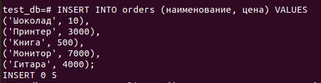

### Задача 1
Используя docker поднимите инстанс PostgreSQL (версию 12) c 2 volume, в который будут складываться данные БД и бэкапы.

Приведите получившуюся команду или docker-compose манифест.

`Ответ:`

### Задача 2

`Ответ:`

В БД из задачи 1:

- создайте пользователя test-admin-user и БД test_db

- в БД test_db создайте таблицу orders и clients

- предоставьте привилегии на все операции пользователю test-admin-user на таблицы БД test_db

- создайте пользователя test-simple-user

- предоставьте пользователю test-simple-user права на SELECT/INSERT/UPDATE/DELETE данных таблиц БД test_db

- итоговый список БД после выполнения пунктов выше

- описание таблиц (describe)

- SQL-запрос для выдачи списка пользователей с правами над таблицами test_db

- список пользователей с правами над таблицами test_db

### Задача 3
Используя SQL синтаксис - наполните таблицы следующими тестовыми данными

`Ответ:`

- вычислите количество записей для каждой таблицы

### Задача 4
Часть пользователей из таблицы clients решили оформить заказы из таблицы orders.

Используя foreign keys свяжите записи из таблиц, согласно таблице

`Ответ:`

- Приведите SQL-запрос для выдачи всех пользователей, которые совершили заказ, а также вывод данного запроса

### Задача 5
Получите полную информацию по выполнению запроса выдачи всех пользователей из задачи 4 (используя директиву EXPLAIN).

Приведите получившийся результат и объясните что значат полученные значения.

`Ответ:`

Выведен план выполнения запроса и стоимость выполнения каждого шага плана. 
cost 37 - затраты на получение первой записи; 57.24 - затраты на получение всех записей; 
rows = 810 - приблизительное количество возвращаемых записей при выполнении операци; width=64 - средний размер одной записи в байтах

### Задача 6
Создайте бэкап БД test_db и поместите его в volume, предназначенный для бэкапов (см. Задачу 1).

Остановите контейнер с PostgreSQL (но не удаляйте volumes).

- Поднимите новый пустой контейнер с PostgreSQL.

- Поднимите новый пустой контейнер с PostgreSQL.

- Восстановите БД test_db в новом контейнере.

Приведите список операций, который вы применяли для бэкапа данных и восстановления.

