### Задача 1
`Используя docker поднимите инстанс MySQL (версию 8). Данные БД сохраните в volume.`

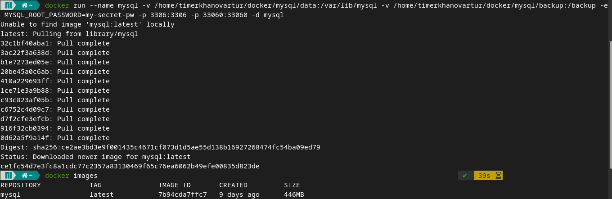

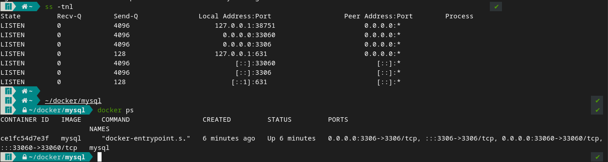

`Изучите бэкап БД и восстановитесь из него.`

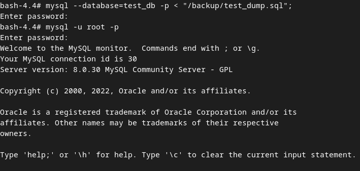

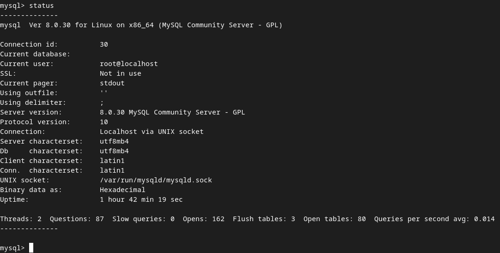

`Подключитесь к восстановленной БД и получите список таблиц из этой БД.`

`Приведите в ответе количество записей с price > 300.`

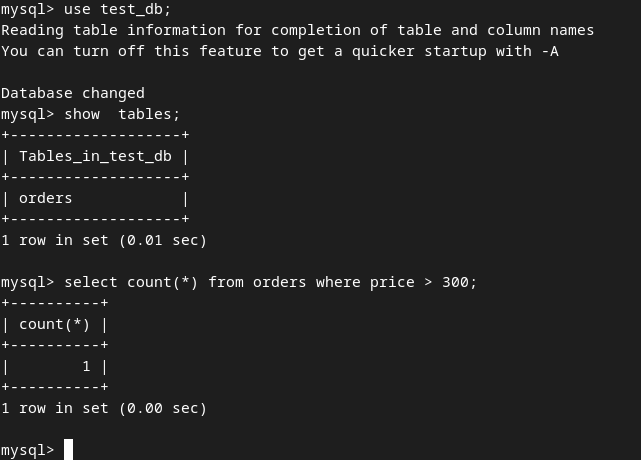

### Задача 2
Создайте пользователя test в БД c паролем test-pass, используя:

- плагин авторизации mysql_native_password
- срок истечения пароля - 180 дней
- количество попыток авторизации - 3
- максимальное количество запросов в час - 100
- аттрибуты пользователя:
  - Фамилия "Pretty"
  - Имя "James"
  - 
Предоставьте привелегии пользователю test на операции SELECT базы test_db.

Используя таблицу INFORMATION_SCHEMA.USER_ATTRIBUTES получите данные по пользователю test и приведите в ответе к задаче.

`Ответ:`

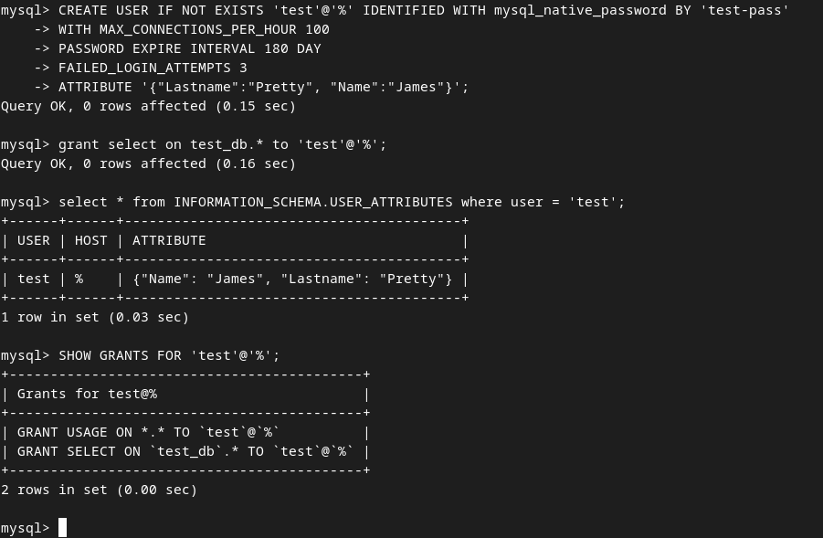

### Задача 3
Установите профилирование SET profiling = 1. Изучите вывод профилирования команд SHOW PROFILES;.

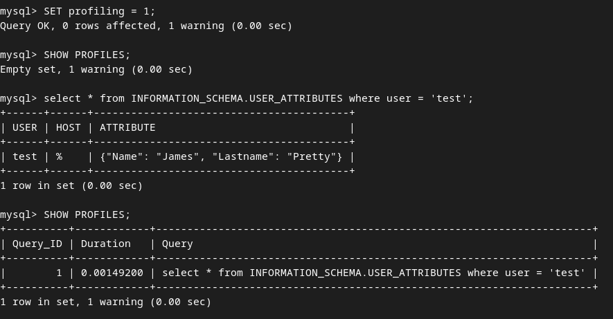

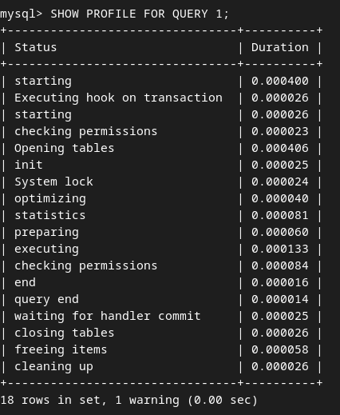

Исследуйте, какой engine используется в таблице БД test_db и приведите в ответе.

Для таблиц БД test_db используется engine InnoDB

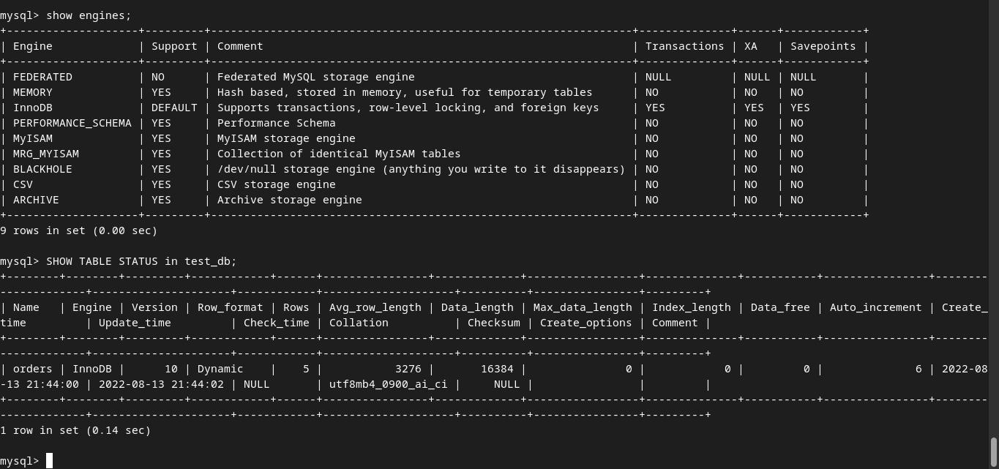

Измените engine и приведите время выполнения и запрос на изменения из профайлера в ответе:

- на MyISAM
- на InnoDB

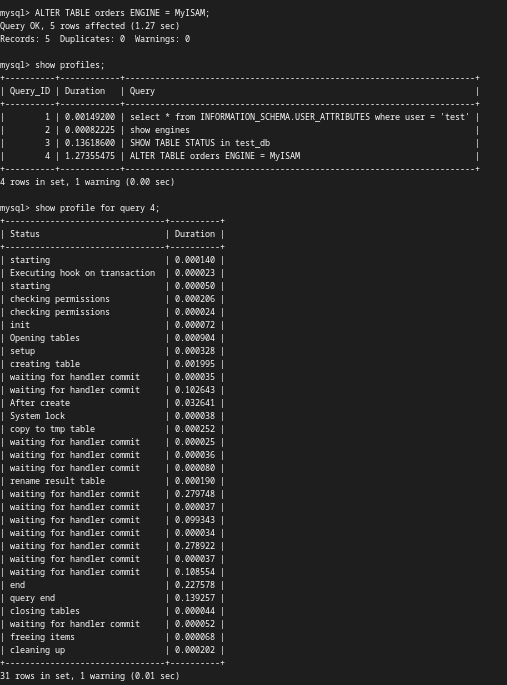

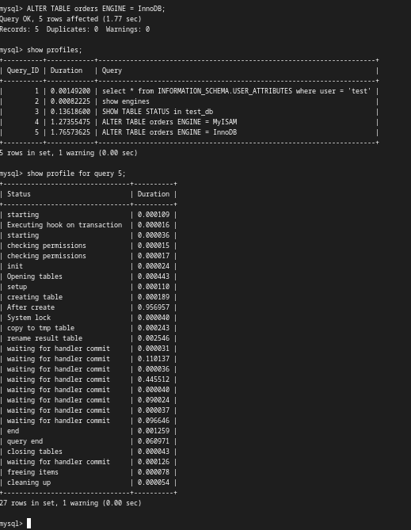
<br>
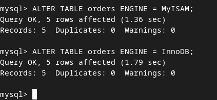

### Задача 4
Изучите файл my.cnf в директории /etc/mysql.

Измените его согласно ТЗ (движок InnoDB):

- Скорость IO важнее сохранности данных
- Нужна компрессия таблиц для экономии места на диске
- Размер буффера с незакомиченными транзакциями 1 Мб
- Буффер кеширования 30% от ОЗУ
- Размер файла логов операций 100 Мб
  
Приведите в ответе измененный файл my.cnf.

```
[mysqld]
pid-file        = /var/run/mysqld/mysqld.pid
socket          = /var/run/mysqld/mysqld.sock
datadir         = /var/lib/mysql
secure-file-priv= NULL

# Custom config should go here
!includedir /etc/mysql/conf.d/

innodb_flush_log_at_trx_commit = 0 # Скорость IO важнее сохранности данных
innodb_file_per_table = ON # Нужна компрессия таблиц для экономии места на диске
innodb_log_buffer_size = 1M # Размер буффера с незакомиченными транзакциями 1 Мб
innodb_buffer_pool_size = 1G # Буффер кеширования 30% от ОЗУ
innodb_log_file_size = 100M # Размер файла логов операций 100 Мб
```