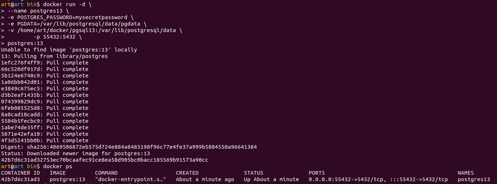
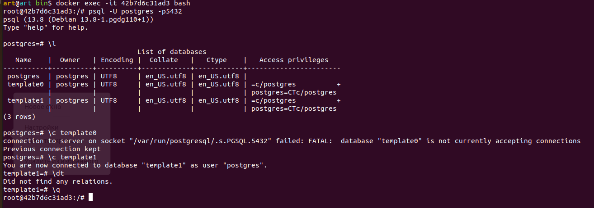

### Задача 1
`Используя docker поднимаем инстанс PostgreSQL (версию 13). Данные БД сохраняются в volume.`

Воспользуйтесь командой \? для вывода подсказки по имеющимся в psql управляющим командам.

Найдите и приведите управляющие команды для:

- вывода списка БД
- подключения к БД
- вывода списка таблиц
- вывода описания содержимого таблиц
- выхода из psql

`Ответ:`

####Управляющие команды для:

- вывода списка БД:

`\l[+]   [PATTERN]      list databases`

- подключения к БД:

`\c[onnect] {[DBNAME|- USER|- HOST|- PORT|-] | conninfo} connect to new database (currently "postgres")`

- вывода списка таблиц:

`\dt[S+] [PATTERN] list tables`

- вывода описания содержимого таблиц:

`\d[S+] list tables, views, and sequences`

- выхода из psql:

`\q quit psql`

