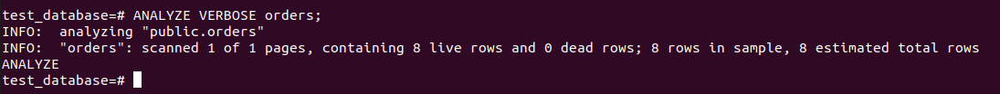

### Задача 1
`Используя docker поднимаем инстанс PostgreSQL (версию 13). Данные БД сохраняются в volume.`

Воспользуйтесь командой \? для вывода подсказки по имеющимся в psql управляющим командам.

Найдите и приведите управляющие команды для:

- вывода списка БД
- подключения к БД
- вывода списка таблиц
- вывода описания содержимого таблиц
- выхода из psql

`Ответ:`

####Управляющие команды для:

- вывода списка БД:

`\l[+]   [PATTERN]      list databases`

- подключения к БД:

`\c[onnect] {[DBNAME|- USER|- HOST|- PORT|-] | conninfo} connect to new database (currently "postgres")`

- вывода списка таблиц:

`\dt[S+] [PATTERN] list tables`

- вывода описания содержимого таблиц:

`\d[S+] list tables, views, and sequences`

- выхода из psql:

`\q quit psql`


### Задача 2
`Используя psql создайте БД test_database.`


`Восстановите бэкап БД в test_database.`


`Подключитесь к восстановленной БД и проведите операцию ANALYZE для сбора статистики по таблице.`



'Используя таблицу pg_stats, найдите столбец таблицы orders с наибольшим средним значением размера элементов в байтах.'


```
SELECT attname, avg_width 
                  FROM pg_stats 
                 WHERE tablename='orders' 
                   AND avg_width=(SELECT MAX(avg_width) 
                                    FROM pg_stats 
                                   WHERE tablename='orders');
```

### Задача 3
`Поставленную задачу буду решать с помощью партиционирования, путем созданиея двух двух таблиц`


`Исключить изначально "ручное" разбиение таблицы было бы возможно, если на этапе начального проектирования создать партиционированную таблицу.`

### Задача 4
>Используя утилиту pg_dump создайте бекап БД test_database.cd


>Как бы вы доработали бэкап-файл, чтобы добавить уникальность значения столбца title для таблиц test_database?
```
CREATE UNIQUE INDEX title_unique ON orders (title, price);
```
