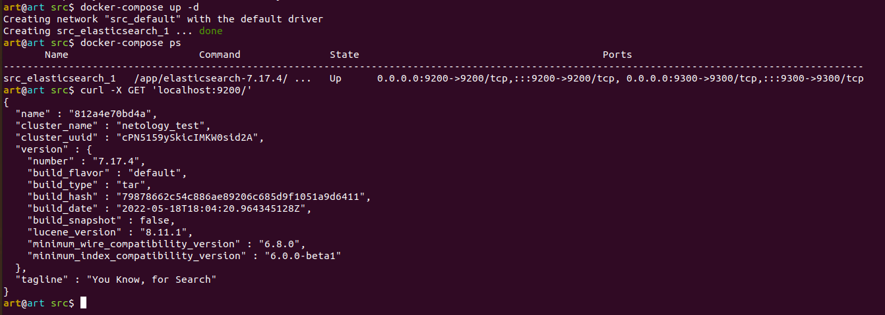
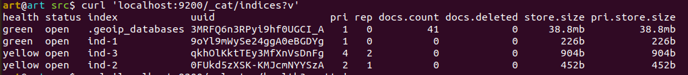
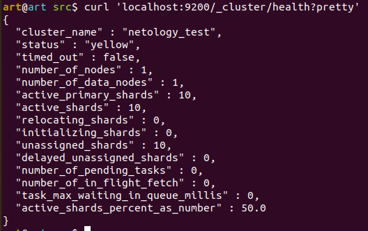
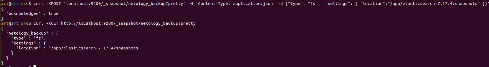
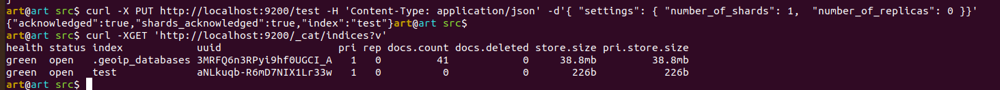
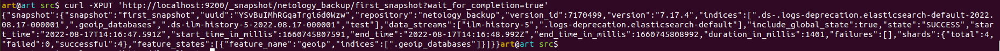
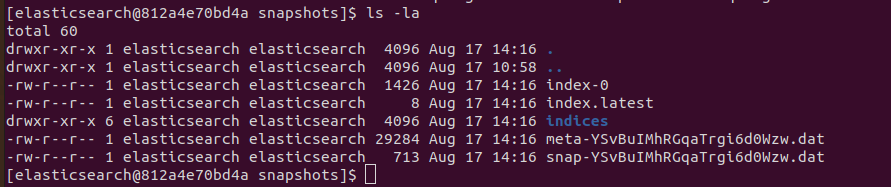
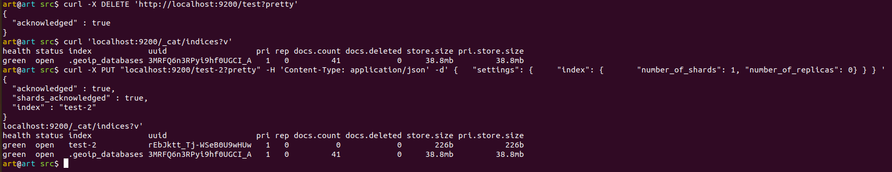
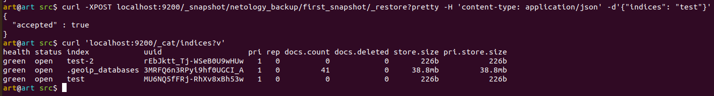

### Задача 1
- текст Dockerfile манифеста

```
FROM centos:7
WORKDIR /app
ENV PATH=/usr/lib:$PATH

RUN yum install java-11-openjdk -y
RUN yum install wget -y

RUN wget https://artifacts.elastic.co/downloads/elasticsearch/elasticsearch-7.17.4-linux-x86_64.tar.gz \
  && wget https://artifacts.elastic.co/downloads/elasticsearch/elasticsearch-7.17.4-linux-x86_64.tar.gz.sha512
RUN yum install perl-Digest-SHA -y
RUN shasum -a 512 -c elasticsearch-7.17.4-linux-x86_64.tar.gz.sha512 \
  && tar -xzf elasticsearch-7.17.4-linux-x86_64.tar.gz  \
  && yum upgrade -y

#COPY elasticsearch.yml /app/elasticsearch-7.17.4/config/
ENV JAVA_HOME=/app/elasticsearch-7.17.4/jdk/
ENV ES_HOME=/app/elasticsearch-7.17.4
RUN groupadd elasticsearch \
  && useradd -g elasticsearch elasticsearch

RUN mkdir /var/lib/logs \
  && chown elasticsearch:elasticsearch /var/lib/logs \
  && mkdir  /var/lib/data \
  && chown elasticsearch:elasticsearch /var/lib/data \
  && chown -R elasticsearch:elasticsearch /app/elasticsearch-7.17.4/
RUN mkdir  /app/elasticsearch-7.17.4/snapshots \
  && chown elasticsearch:elasticsearch /app/elasticsearch-7.17.4/snapshots

USER elasticsearch
CMD ["/usr/sbin/init"]
CMD ["/app/elasticsearch-7.17.4/bin/elasticsearch"]
```

- ссылку на образ в репозитории dockerhub

`docker build -t girevik1/elasticsearch:7.17.4 .`

`docker push girevik1/elasticsearch:7.17.4`

[Образ в репозитории](https://hub.docker.com/r/girevik1/elasticsearch)

- ответ elasticsearch на запрос пути / в json виде



### Задача 2

- Создать индексы

`curl -X PUT http://localhost:9200/ind-1 -H 'Content-Type: application/json' -d'{ "settings": { "number_of_shards": 1,  "number_of_replicas": 0 }}'`

`curl -X PUT http://localhost:9200/ind-2 -H 'Content-Type: application/json' -d'{ "settings": { "number_of_shards": 2,  "number_of_replicas": 1 }}'`

`curl -X PUT http://localhost:9200/ind-3 -H 'Content-Type: application/json' -d'{ "settings": { "number_of_shards": 4,  "number_of_replicas": 2 }}'`

- Получить список и статус индексов



- Получить статус кластера



- Как вы думаете, почему часть индексов и кластер находится в состоянии yellow?

>Потому, что у некоторых индекстов объявлено ненулевое количество реплик, а количество активных нод всего 1.

- Удаление индексов:


### Задача 3

- Создать репозиторий



- Создайте индекс `test` с 0 реплик и 1 шардом и приведите в ответе список индексов.



- Создайте `snapshot` состояния кластера `elasticsearch`.



- Приведите в ответе список файлов в директории со snapshotами.



- Удалите индекс test и создайте индекс test-2. Приведите в ответе список индексов.



- Восстановите состояние кластера `elasticsearch` из `snapshot`, созданного ранее.




