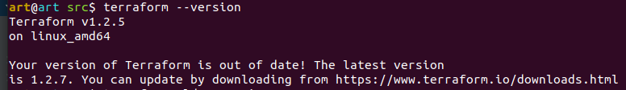
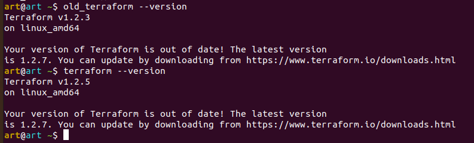

### Задача 1

`Ответ:`

>1.1. Лучше всего использовать неизменяемую инфраструктуру, весь код инфраструктуры будет храниться в VCS, 
можно будет быстро разворачивать и откатывать изменения в инфрастуктуре. Также такой подход позволит избежать configuration drift 
(незадокументированных изменений инфраструктуры) на этапе становления системы. 
1.2. Центральный сервер на данном этапе не нужен - заказчик один, серверов скорее всего будет не так много, и отвлекаться на поддержку центрального сервера на данном этапе нет необходимости.  
1.3. Агенты управления конфигурацией использоваться не будут.  
1.4. Будут использованы средства для управления конфигурацией - Kubernetes и инициализации ресурсов - Terraform.

>2. Максимально будут использоваться уже известные инструменты Packer - создание образов для ВМ, Terraform - разворачивание виртуальной среды, Docker - упаковка приложений, Teamcity - автоматизация процессов, Kubernetes - для управления конфигурацией/инфраструктурой.

>3. Новые инструменты будут рассматриваться по ходу проекта при необходимости решения задач по мере поступления.

### Задача 2

### Задача 3
>wget https://releases.hashicorp.com/terraform/1.2.3/terraform_1.2.3_linux_amd64.zip

>unzip terraform_1.2.3_linux_amd64.zip

>sudo cp old_terraform /usr/bin/

>Так же можно использовать инструменты tfenv или tfswitch