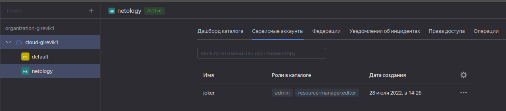
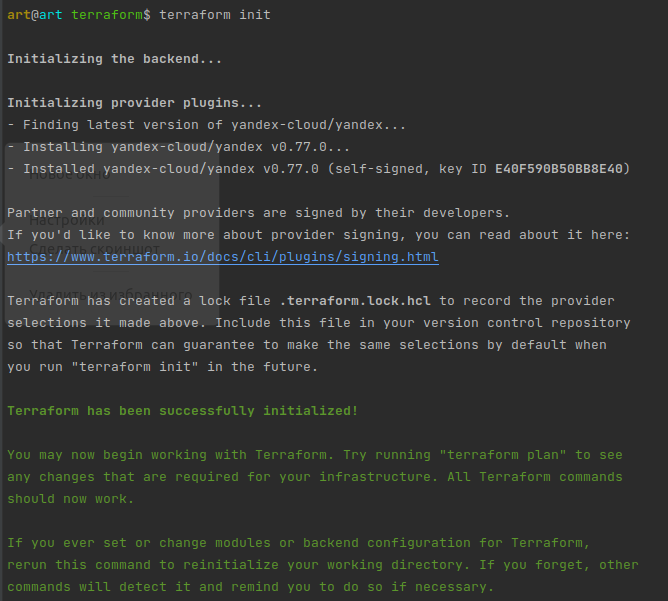
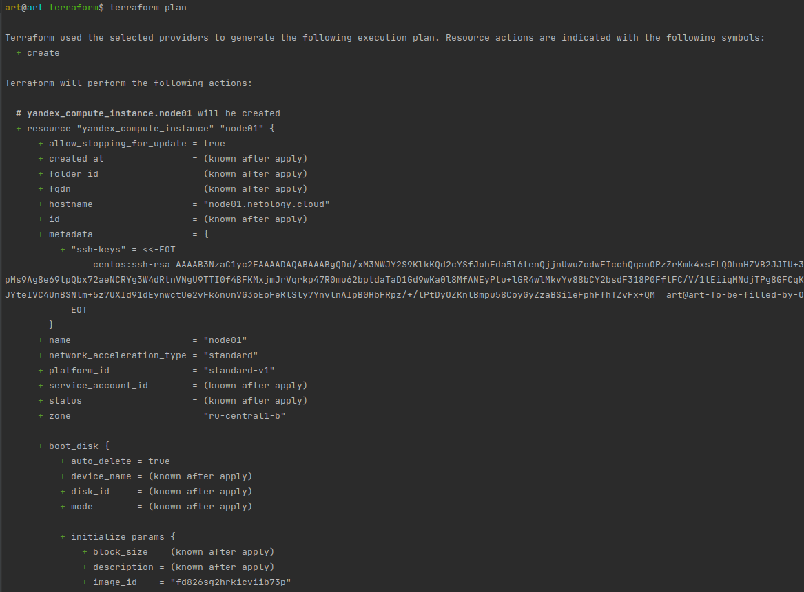
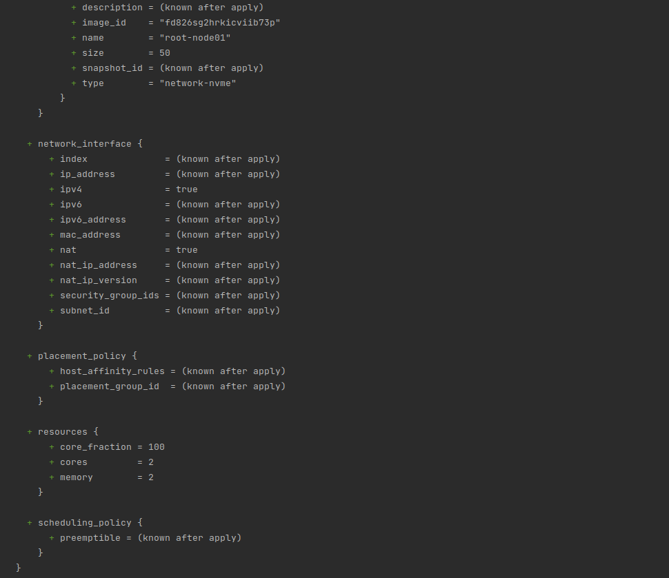
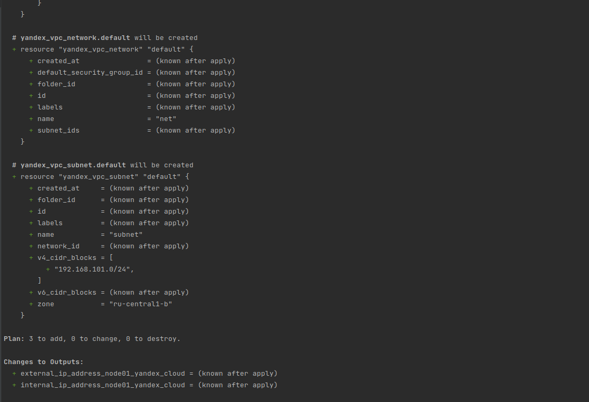

### Задача 1  (Вариант с Yandex.Cloud)
Регистрация в ЯО была успешна произведена в предыдущих практических заданиях.



`main.tf` берет значения из переменых окружения.
```bash
provider "yandex" {
  service_account_key_file = "key.json"
  cloud_id  = "${var.yandex_cloud_id}"
  folder_id = "${var.yandex_folder_id}"
  zone      = "ru-central1-a"
}
```

Так же можно указать приватные данные в коде применив подход через экспорт переменных:

```bash
export TF_VAR_yandex_token=`yc iam create-token`
export TF_VAR_yandex_cloud_id=`yc config get cloud-id`
export TF_VAR_yandex_folder_id=`yc config get folder-id`
```

### Задача 2  (Вариант с Yandex.Cloud)






* При помощи какого инструмента (из разобранных на прошлом занятии) можно создать свой образ ami?

>При помощи `packer`

* [Ссылку на репозиторий](https://github.com/Girevik1/devops-netology/tree/main/07-terraform-02-syntax/terraform)