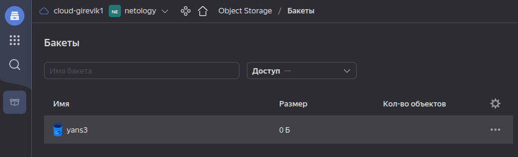
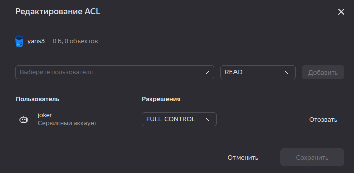
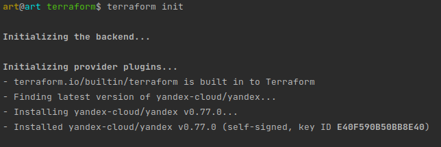
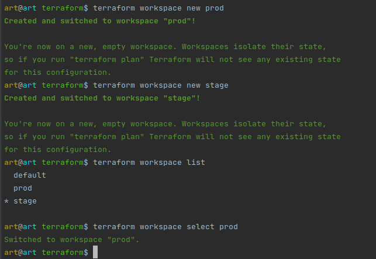
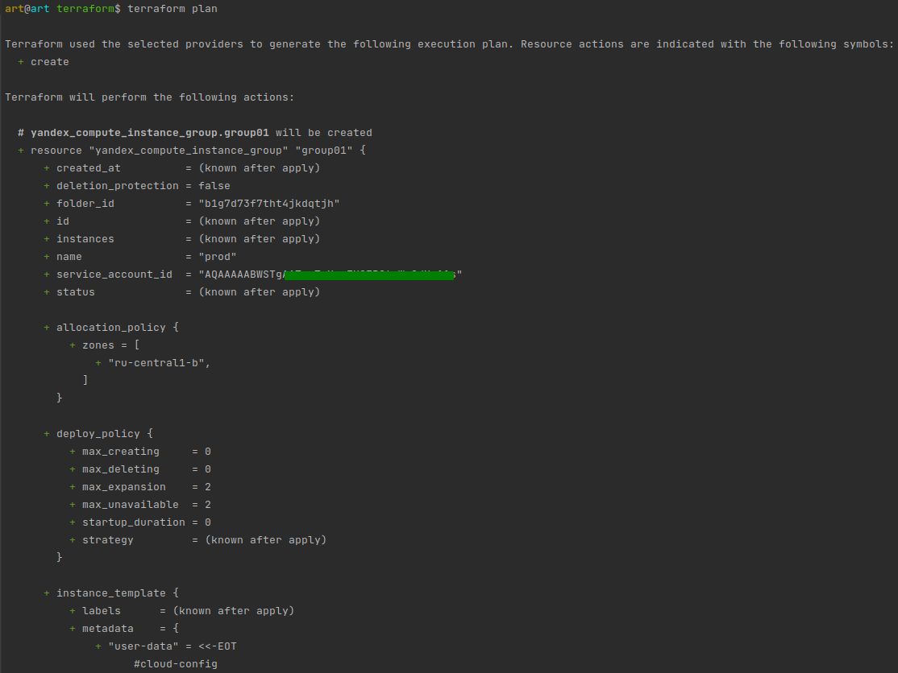
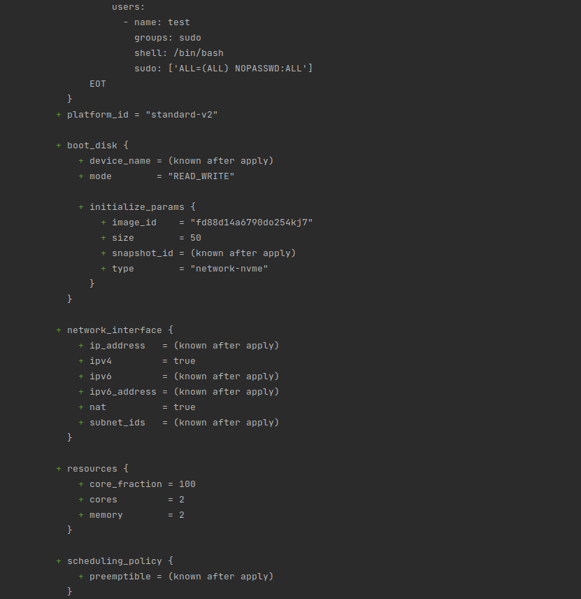
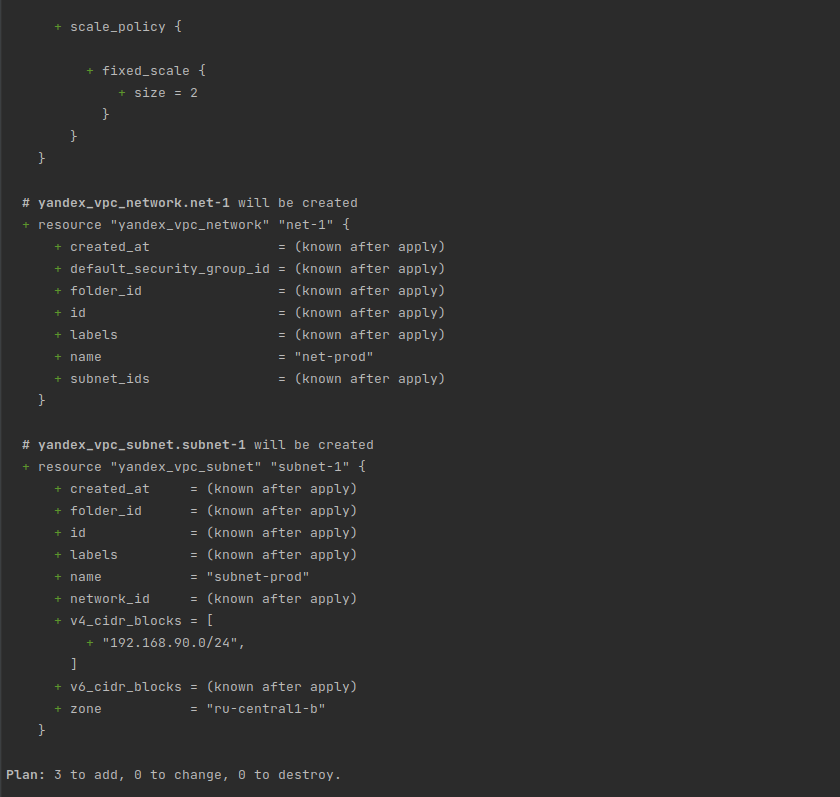

### Задача 1. По причинам санкций пункт пришлось решить через Yandex.Cloud

### Задача 2. Инициализируем проект и создаем воркспейсы.
В виде результата работы пришлите:

* Вывод команды terraform workspace list.
* Вывод команды terraform plan для воркспейса prod.

`Ответ:`

