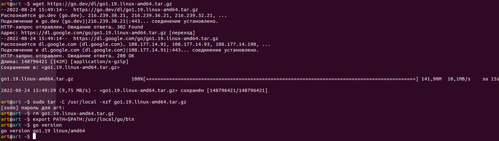

### Задача 1. Установите golang.



### Задача 2. Знакомство с gotour.

>Освоено

### Задача 3. Написание кода.

- Напишите программу для перевода метров в футы (1 фут = 0.3048 метр). Можно запросить исходные данные у пользователя, а можно статически задать в коде. Для взаимодействия с пользователем можно использовать функцию Scanf:

```
package main

import "fmt"

func m2f(a float64) float64 {
    var x float64
    x = a / 0.3048
    return x
}

func main() {
    fmt.Print("Enter a number: ")
    var input float64
    fmt.Scanf("%f", &input)

    output := m2f(input)

    fmt.Println(output)
}
```

- Напишите программу, которая найдет наименьший элемент в любом заданном списке

```
package main

import "fmt"

func min(xs []int) int {
	var xm int
	xm = xs[0]
	for _, xi := range xs {
		if xi < xm {
			xm = xi
		}
	}
	return xm
}

func main() {
	x := []int{48, 96, 86, 68, 57, 82, 63, 70, 37, 34, 83, 27, 19, 97, 9, 17}
	xm := min(x)
	fmt.Println(xm)
}
```

- Напишите программу, которая выводит числа от 1 до 100, которые делятся на 3. То есть `(3, 6, 9, …)`.

```
package main

import "fmt"

func div3(xs [100]int) []int {
  var x3 []int
  for i, _ := range xs {
    if (i+1)%3 == 0 {
      x3 = append(x3, i+1)
    }
  }
  return x3
}

func main() {
  x := [100]int{}
  x3 := div3(x)
  fmt.Println(x3)
}
```

[Cсылка на код](https://github.com/Girevik1/devops-netology/tree/main/07-terraform-05-golang/src)
