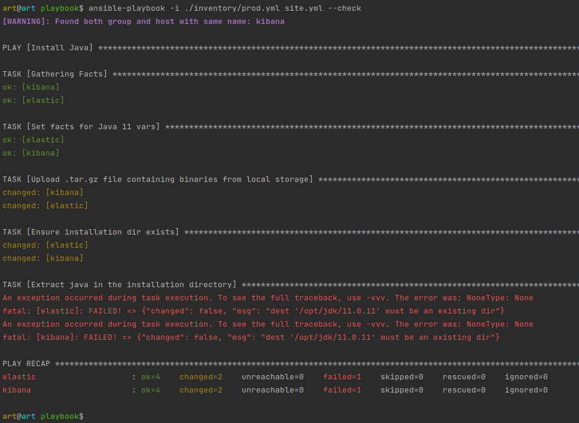
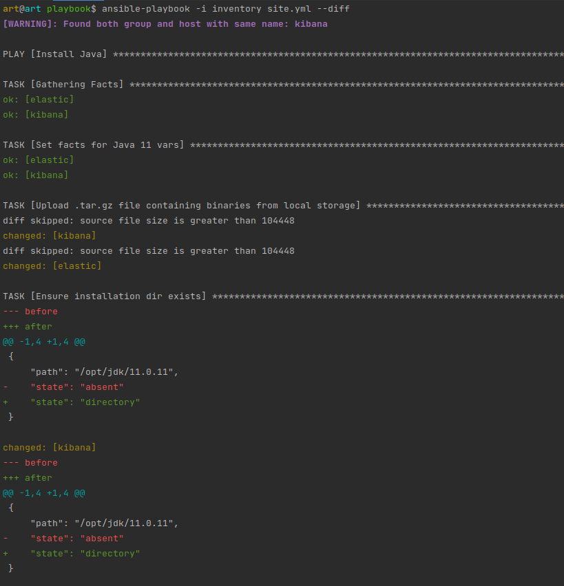
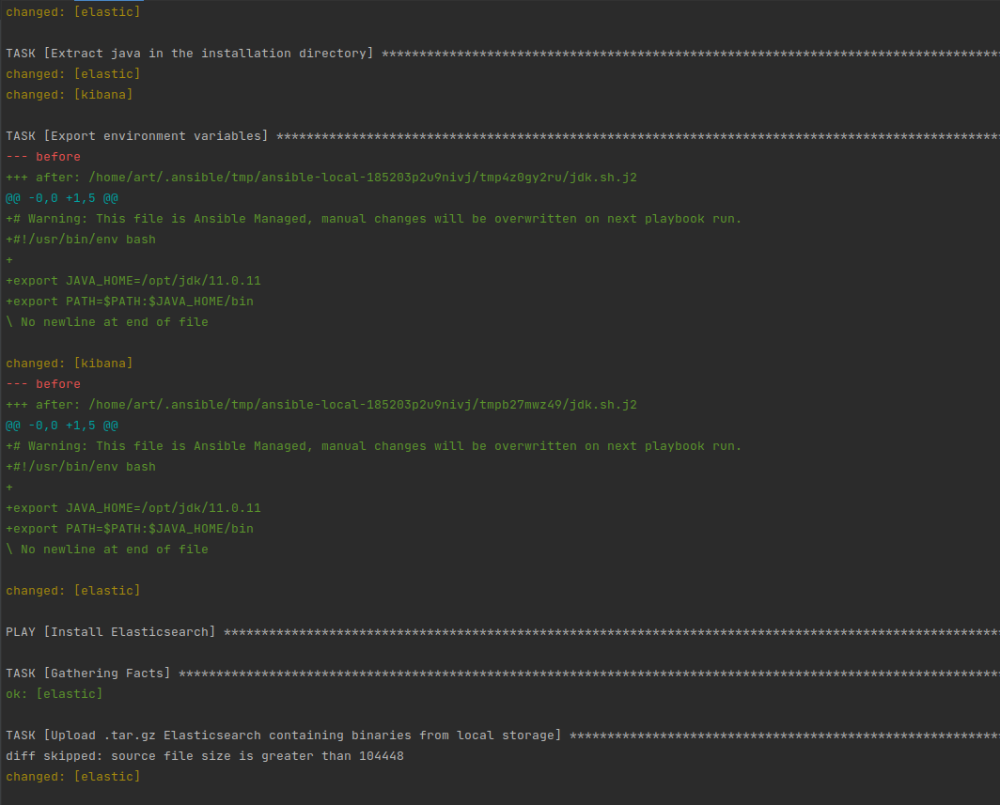
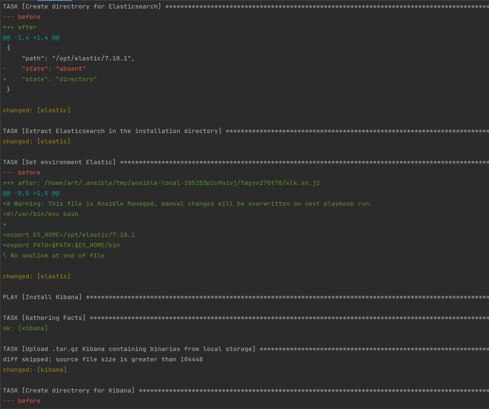
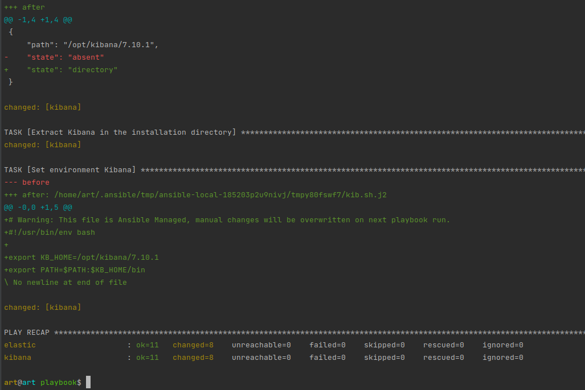
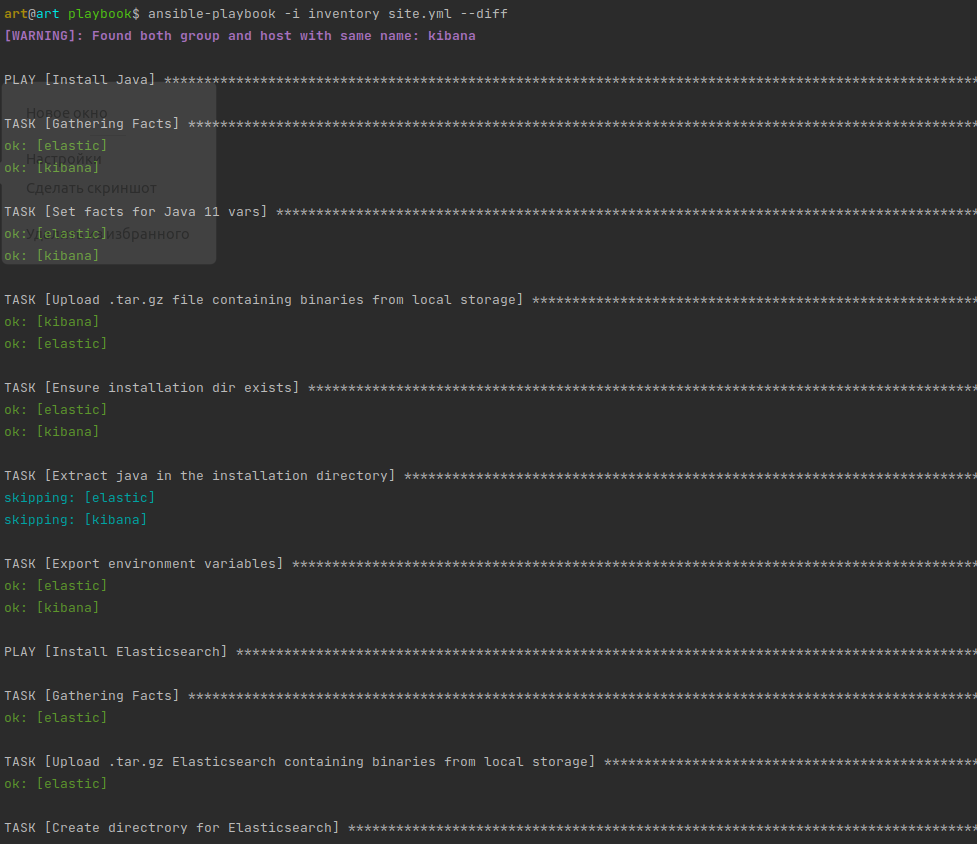
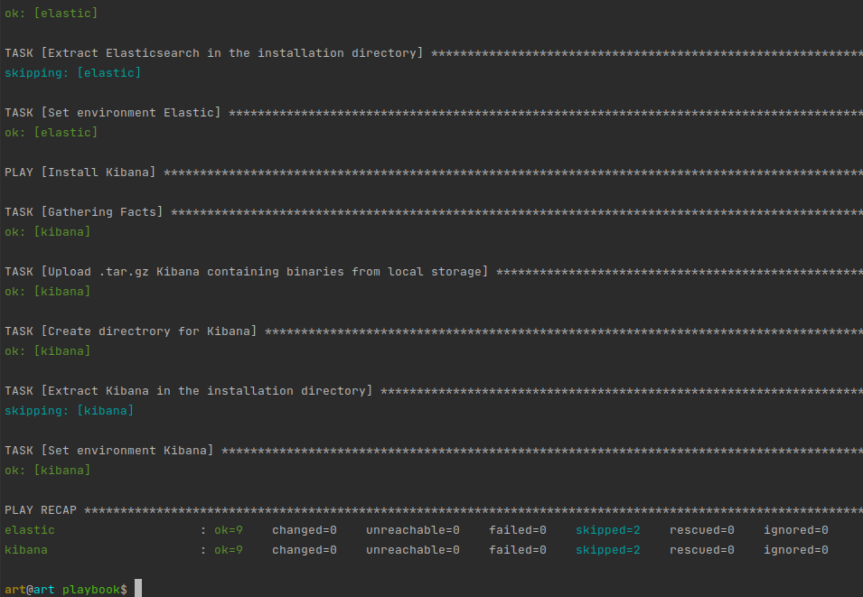

### Задача 1. 
#### Подготовка к выполнению
1. Создайте свой собственный (или используйте старый) публичный репозиторий на github с произвольным именем.

`DONE`

2. Скачайте playbook из репозитория с домашним заданием и перенесите его в свой репозиторий.

`DONE`

3. Подготовьте хосты в соотвтествии с группами из предподготовленного playbook.
- Использовал `docker-compose.yml`
```yaml
version: '3'
services:
  elastic:
    image: pycontribs/ubuntu
    container_name: elastic
    restart: unless-stopped
    entrypoint: "sleep infinity"

  kibana:
    image: pycontribs/ubuntu
    container_name: kibana
    restart: unless-stopped
    entrypoint: "sleep infinity"
```

4. Скачайте дистрибутив java и положите его в директорию playbook/files/.

`DONE`

#### Основная часть
1. Приготовьте свой собственный inventory файл `prod.yml`.
```yaml
---
elasticsearch:
  hosts:
    elastic:
      ansible_connection: docker
kibana:
  hosts:
    kibana:
      ansible_connection: docker
```
2. Допишите playbook: нужно сделать ещё один `play`, который устанавливает и настраивает `kibana`.
3. При создании `tasks` рекомендую использовать модули: `get_url`, `template`, `unarchive`, `file`.
4. `Tasks` должны: скачать нужной версии дистрибутив, выполнить распаковку в выбранную директорию, сгенерировать конфигурацию с параметрами.
```yaml
---
- name: Install Java
  hosts: all
  tasks:
    - name: Set facts for Java 11 vars
      set_fact:
        java_home: "/opt/jdk/{{ java_jdk_version }}"
      tags: java
    - name: Upload .tar.gz file containing binaries from local storage
      copy:
        src: "{{ java_oracle_jdk_package }}"
        dest: "/tmp/jdk-{{ java_jdk_version }}.tar.gz"
      register: download_java_binaries
      until: download_java_binaries is succeeded
      tags: java
    - name: Ensure installation dir exists
      become: true
      file:
        state: directory
        path: "{{ java_home }}"
      tags: java
    - name: Extract java in the installation directory
      become: true
      unarchive:
        copy: false
        src: "/tmp/jdk-{{ java_jdk_version }}.tar.gz"
        dest: "{{ java_home }}"
        extra_opts: [--strip-components=1]
        creates: "{{ java_home }}/bin/java"
      tags:
        - java
    - name: Export environment variables
      become: true
      template:
        src: jdk.sh.j2
        dest: /etc/profile.d/jdk.sh
      tags: java
- name: Install Elasticsearch
  hosts: elasticsearch
  tasks:
    - name: Upload .tar.gz Elasticsearch containing binaries from local storage
      copy:
        src: "{{ elastic_package }}"
        dest: "/tmp/elasticsearch-{{ elastic_version }}-linux-x86_64.tar.gz"
      register: download_elastic_binaries
      until: download_elastic_binaries is succeeded
      tags: elastic

    - name: Create directrory for Elasticsearch
      file:
        state: directory
        path: "{{ elastic_home }}"
      tags: elastic
    - name: Extract Elasticsearch in the installation directory
      become: true
      unarchive:
        copy: false
        src: "/tmp/elasticsearch-{{ elastic_version }}-linux-x86_64.tar.gz"
        dest: "{{ elastic_home }}"
        extra_opts: [--strip-components=1]
        creates: "{{ elastic_home }}/bin/elasticsearch"
      tags:
        - elastic
    - name: Set environment Elastic
      become: true
      template:
        src: templates/elk.sh.j2
        dest: /etc/profile.d/elk.sh
      tags: elastic

- name: Install Kibana
  hosts: kibana
  tasks:
    - name: Upload .tar.gz Kibana containing binaries from local storage
      copy:
        src: "{{ kibana_package }}"
        dest: "/tmp/kibana-{{ kibana_version }}-linux-x86_64.tar.gz"
      register: download_kibana_binaries
      until: download_kibana_binaries is succeeded
      tags: kibana

    - name: Create directrory for Kibana
      file:
        state: directory
        path: "{{ kibana_home }}"
      tags: kibana
    - name: Extract Kibana in the installation directory
      become: true
      unarchive:
        copy: false
        src: "/tmp/kibana-{{ kibana_version }}-linux-x86_64.tar.gz"
        dest: "{{ kibana_home }}"
        extra_opts: [--strip-components=1]
        creates: "{{ kibana_home }}/bin/kibana"
      tags:
        - kibana
    - name: Set environment Kibana
      become: true
      template:
        src: templates/kib.sh.j2
        dest: /etc/profile.d/kib.sh
```
5. Запустите `ansible-lint site.yml` и исправьте ошибки, если они есть.
6. Попробуйте запустить playbook на этом окружении с флагом `--check`.



7. Запустите `playbook` на `prod.yml` окружении с флагом `--diff`. Убедитесь, что изменения на системе произведены.






8. Повторно запустите `playbook` с флагом `--diff` и убедитесь, что playbook идемпотентен.




9. Подготовьте `README.md` файл по своему `playbook`. В нём должно быть описано: что делает `playbook`, какие у него есть параметры и теги.

[Cсылка на README.md](https://github.com/Girevik1/devops-netology/blob/main/08-ansible-02-playbook/scr/README.md)

10. Готовый `playbook` выложите в свой репозиторий, в ответ предоставьте ссылку на него.
git rm -f ./08-ansible-02-playbook/scr/playbook/elasticsearch-7.10.1-linux-x86_64.tar.gz

[Cсылка на playbook](https://github.com/Girevik1/devops-netology/tree/main/08-ansible-02-playbook/scr/playbook)