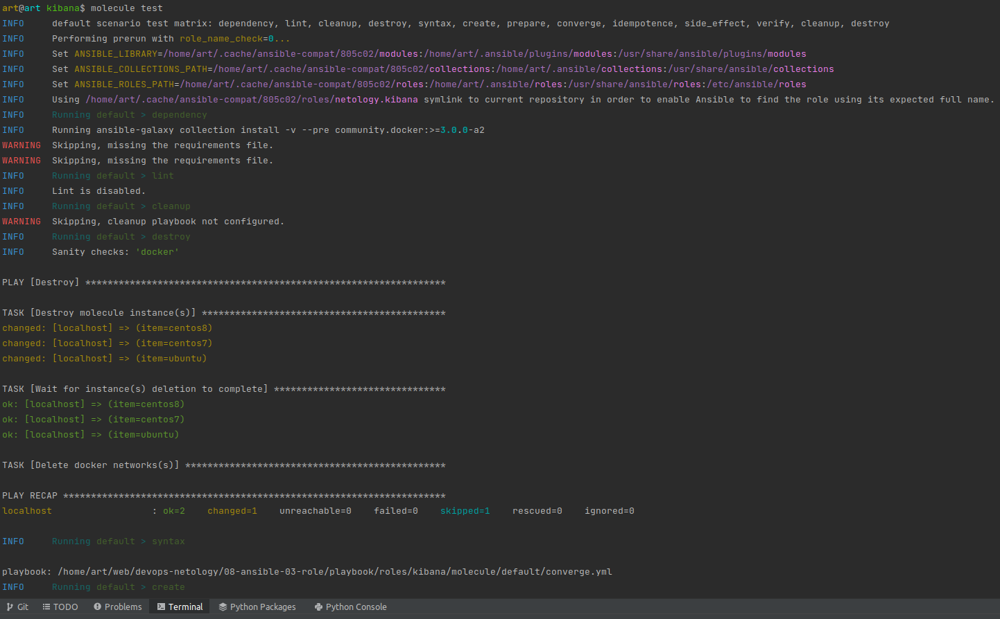

# Домашнее задание к занятию "08.03 Работа с Roles"

## Подготовка к выполнению

1. Создайте два пустых публичных репозитория в любом своём проекте: elastic-role и kibana-role.
2. Скачайте [role](playbook/roles/) из репозитория с домашним заданием и перенесите его в свой репозиторий elastic-role.
3. Скачайте дистрибутив [java](https://www.oracle.com/java/technologies/javase-jdk11-downloads.html) и положите его в директорию `playbook/files/`. 
4. Установите molecule: `pip3 install molecule`
5. Добавьте публичную часть своего ключа к своему профилю в github.

## Основная часть

Наша основная цель - разбить наш playbook на отдельные roles. Задача: сделать roles для elastic, kibana и написать playbook для использования этих ролей. Ожидаемый результат: существуют два ваших репозитория с roles и один репозиторий с playbook.

1. Создать в старой версии playbook файл `requirements.yml` и заполнить его следующим содержимым:
   ```yaml
   ---
     - src: git@github.com:netology-code/mnt-homeworks-ansible.git
       scm: git
       version: "1.0.1"
       name: java 
   ```
2. При помощи `ansible-galaxy` скачать себе эту роль. Запустите  `molecule test`, посмотрите на вывод команды.


3. Перейдите в каталог с ролью elastic-role и создайте сценарий тестирования по умолчаню при помощи `molecule init scenario --driver-name docker`.


4. Добавьте несколько разных дистрибутивов (centos:8, ubuntu:latest) для инстансов и протестируйте роль, исправьте найденные ошибки, если они есть.
5. Создайте новый каталог с ролью при помощи `molecule init role --driver-name docker kibana-role`. Можете использовать другой драйвер, который более удобен вам.


6. На основе tasks из старого playbook заполните новую role. Разнесите переменные между `vars` и `default`. Проведите тестирование на разных дистрибитивах (centos:7, centos:8, ubuntu).


7. Выложите все roles в репозитории. Проставьте тэги, используя семантическую нумерацию.
8. Добавьте roles в `requirements.yml` в playbook.
9. Переработайте playbook на использование roles.
10. Выложите playbook в репозиторий.

11. В ответ приведите ссылки на оба репозитория с roles и одну ссылку на репозиторий с playbook.

# Ответ

- https://github.com/Girevik1/elastic-role
- https://github.com/Girevik1/kibana-role
- https://github.com/Girevik1/devops-netology/tree/main/08-ansible-03-role/playbook

## Необязательная часть

1. Проделайте схожие манипуляции для создания роли logstash.
2. Создайте дополнительный набор tasks, который позволяет обновлять стек ELK.
3. В ролях добавьте тестирование в раздел `verify.yml`. Данный раздел должен проверять, что elastic запущен и возвращает успешный статус по API, web-интерфейс kibana отвечает без кодов ошибки, logstash через команду `logstash -e 'input { stdin { } } output { stdout {} }'`.
4. Убедитесь в работоспособности своего стека. Возможно, потребуется тестировать все роли одновременно.
5. Выложите свои roles в репозитории. В ответ приведите ссылки.

---

### Как оформить ДЗ?

Выполненное домашнее задание пришлите ссылкой на .md-файл в вашем репозитории.

---