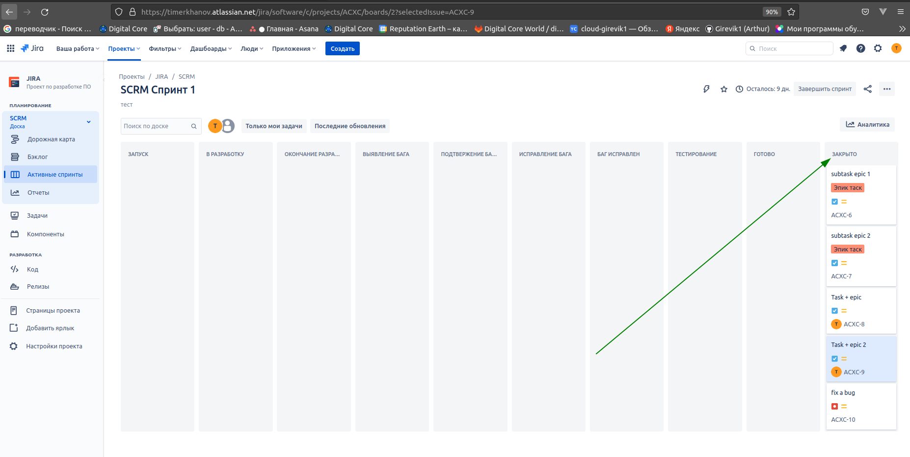

# Домашнее задание к занятию "09.01 Жизненный цикл ПО"

## Подготовка к выполнению

1. Получить бесплатную JIRA
2. Настроить её для своей "команды разработки"
3. Создать доски kanban и scrum

## Основная часть

---
В рамках основной части необходимо создать собственные workflow для двух типов задач: bug и остальные типы задач.

Задачи типа bug должны проходить следующий жизненный цикл:

1. Open -> On reproduce
2. On reproduce <-> Open, Done reproduce
3. Done reproduce -> On fix
4. On fix <-> On reproduce, Done fix
5. Done fix -> On test
6. On test <-> On fix, Done
7. Done <-> Closed, Open

Остальные задачи должны проходить по упрощённому workflow:

1. Open -> On develop
2. On develop <-> Open, Done develop
3. Done develop -> On test
4. On test <-> On develop, Done
5. Done <-> Closed, Open

Создать задачу с типом bug, попытаться провести его по всему workflow до Done. Создать задачу с типом epic,  
к ней привязать несколько задач с типом task, провести их по всему workflow до Done.  При проведении обеих задач по статусам использовать kanban. Вернуть задачи в статус Open.

Потренировался и так же создал в задаче с типом epic - 2 подзадачи.

Перейти в scrum, запланировать новый спринт, состоящий из задач эпика и одного бага, стартовать спринт, провести задачи до состояния Closed. Закрыть спринт.

Если всё отработало в рамках ожидания - выгрузить схемы workflow для импорта в XML. Файлы с workflow приложить к решению задания.

>XML [bug](https://www.oracle.com/java/technologies/javase-jdk11-downloads.html) and [other](https://www.oracle.com/java/technologies/javase-jdk11-downloads.html)