## 1. Создайте виртуальную машину Linux.
>Сделано 
> 
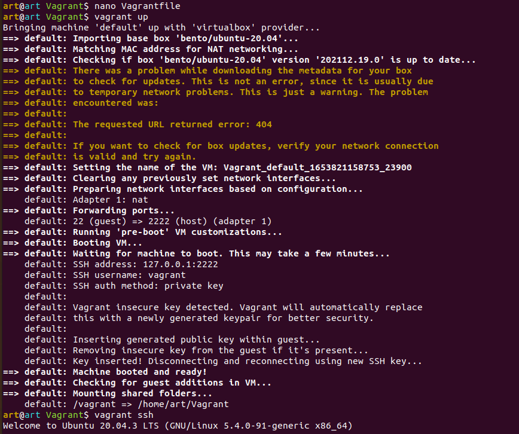

## 2. Установите ufw и разрешите к этой машине сессии на порты 22 и 443, при этом трафик на интерфейсе localhost (lo) должен ходить свободно на все порты.
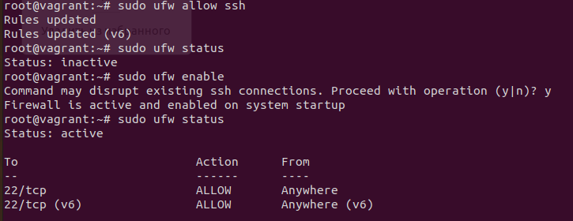
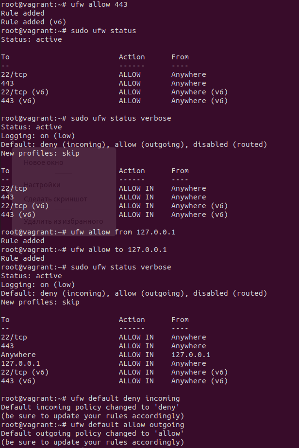

## 3. Установите hashicorp vault
```
root@vagrant:~# curl -fsSL https://apt.releases.hashicorp.com/gpg | apt-key add -
root@vagrant:~# apt-add-repository "deb [arch=amd64] https://apt.releases.hashicorp.com $(lsb_release -cs) main"
root@vagrant:~# apt update && apt install vault
```
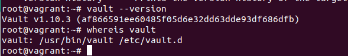

## 4. Cоздайте центр сертификации по инструкции (ссылка) и выпустите сертификат для использования его в настройке веб-сервера nginx (срок жизни сертификата - месяц).
>Запускаем vault server в режиме dev:

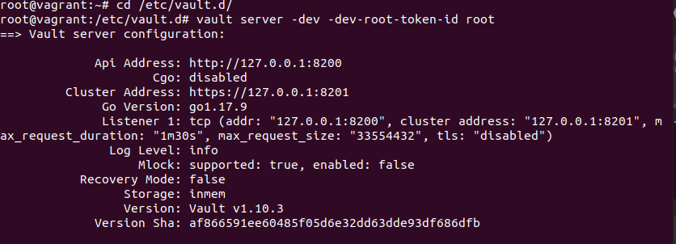

>Добавляем необходимые переменные окружения:
```
root@vagrant:~# export VAULT_ADDR=http://127.0.0.1:8200
root@vagrant:~# export VAULT_TOKEN=root
```
>Подключаем (активируем) ключи pki

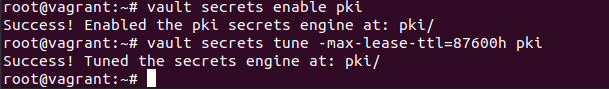

>Создаем свой корневой сертификат:

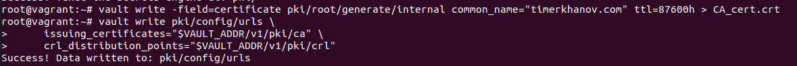

>Создаем промежуточный (CA) сертификат:
```
root@vagrant:~# vault secrets enable -path=pki_int pki
Success! Enabled the pki secrets engine at: pki_int/
```
```
root@vagrant:~# vault secrets tune -max-lease-ttl=43800h pki_int
Success! Tuned the secrets engine at: pki_int/
```
```
root@vagrant:~# vault write -format=json pki_int/intermediate/generate/internal common_name="timerkhanov.com Intermediate Authority" | jq -r '.data.csr' > pki_intermediate.csr
```
```
root@vagrant:~# vault write -format=json pki/root/sign-intermediate csr=@pki_intermediate.csr format=pem_bundle ttl="43800h" | jq -r '.data.certificate' > intermediate.cert.pem
```
```
root@vagrant:~# vault write  pki_int/intermediate/set-signed certificate=@intermediate.cert.pem
Success! Data written to: pki_int/intermediate/set-signed
```
>Создаем роль
```
root@vagrant:~# vault write pki_int/roles/timerkhanov-dot-com allowed_domains="timerkhanov.com" allow_subdomains=true max_ttl="720h"
Success! Data written to: pki_int/roles/timerkhanov-dot-com
```
>Запрашиваем сертификат на 30дн.
```
root@vagrant:~# vault write -format=json pki_int/issue/timerkhanov-dot-com common_name="test.timerkhanov.com" alt_names="test.timerkhanov.com" ttl="720h" > test.timerkhanov.com.crt
```
>Парсим файл сертификата в требуемый формат:
```
root@vagrant:~# cat test.timerkhanov.com.crt | jq -r .data.certificate > test.timerkhanov.com.crt.pem
root@vagrant:~# cat test.timerkhanov.com.crt | jq -r .data.issuing_ca >> test.timerkhanov.com.crt.pem
root@vagrant:~# cat test.timerkhanov.com.crt | jq -r .data.private_key > test.timerkhanov.com.crt.key
```
## 5. Установите корневой сертификат созданного центра сертификации в доверенные в хостовой системе.
>Переносим (копируем) корневой сертификат с виртуальной машины в хостовую:

`root@vagrant:~# scp CA_cert.crt art@10.0.85.1:/home/art/CA_cert.crt`

>На хостовой машине:

`art@art ~$ sudo cp CA_cert.crt /usr/local/share/ca-certificates/`<br>
`art@art ~$ sudo update-ca-certificates`
>Добавляем корневой сертификат в браузер:
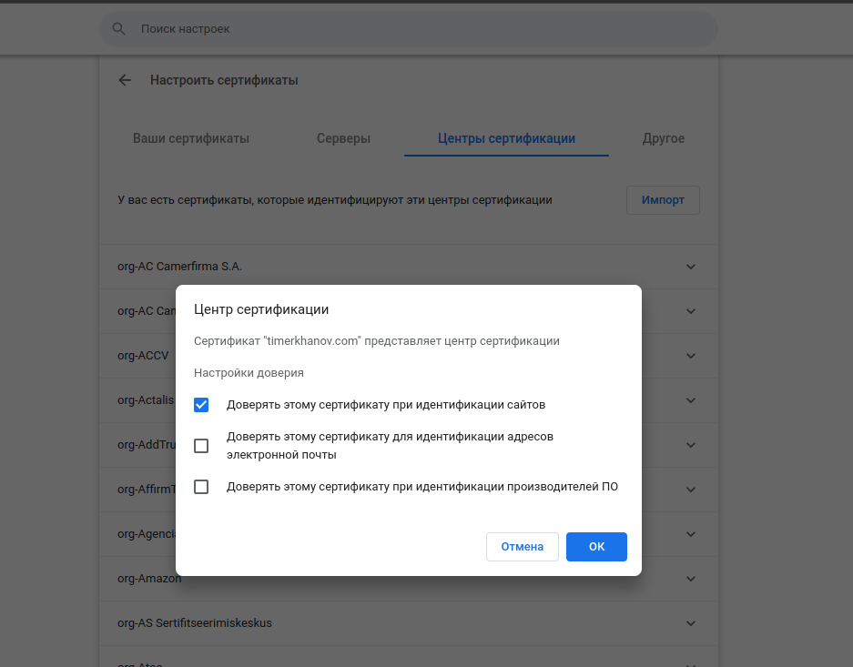
## 6. Установите nginx.
`root@vagrant:~# apt update && apt upgrade`<br>
`root@vagrant:~# apt install nginx`

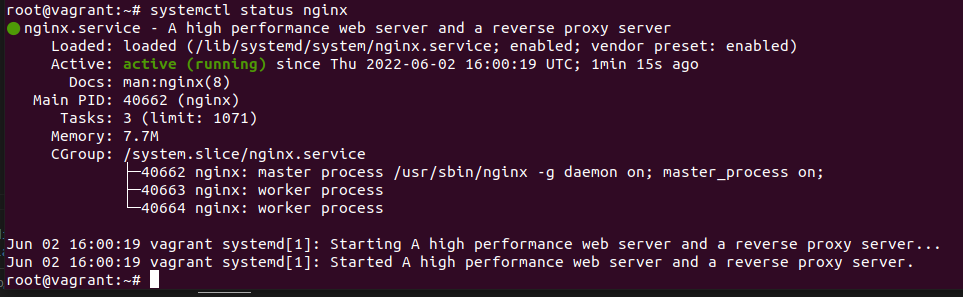

## 7.  По инструкции ([ссылка](https://nginx.org/en/docs/http/configuring_https_servers.html)) настройте nginx на https, используя ранее подготовленный сертификат:
  - можно использовать стандартную стартовую страницу nginx для демонстрации работы сервера;
  - можно использовать и другой html файл, сделанный вами;
>Настройка сайта https и создание тестовой страницы
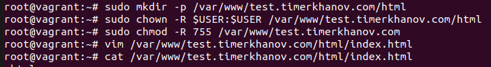

```
<html>
    <head>
        <title>Welcome to test.timerkhanov.com!</title>
    </head>
    <body>
        <h1>Success!  The test.timerkhanov.com is working!</h1>
    </body>
</html>
```
>Создаем виртуальный хост сайта:<br>
`vagrant@vagrant:~$ vim /etc/nginx/sites-available/test.timerkhanov.com`

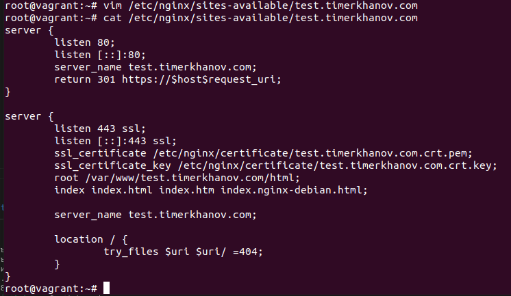
>Soft link для подключения<br>
`vagrant@vagrant:~$ sudo ln -s /etc/nginx/sites-available/test.timerkhanov.com /etc/nginx/sites-enabled/`

> Проверяем конфиг nginx на ошибки и перезапускаем nginx после изменений<br>
> `vagrant@vagrant:~$ sudo nginx -t`
```
nginx: the configuration file /etc/nginx/nginx.conf syntax is ok
nginx: configuration file /etc/nginx/nginx.conf test is successful
```
`vagrant@vagrant:~$ sudo systemctl restart nginx`
## 8. Откройте в браузере на хосте https адрес страницы, которую обслуживает сервер nginx.
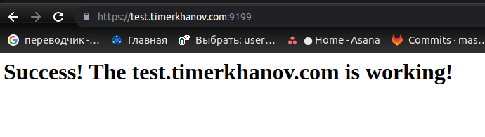
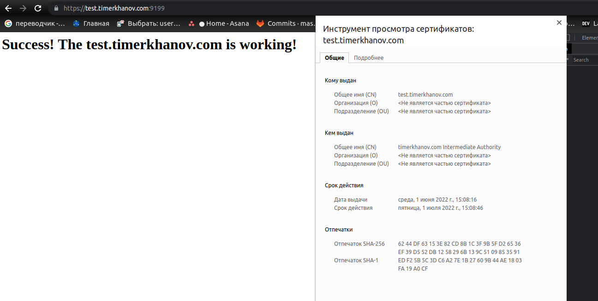
## 9. Создайте скрипт, который будет генерировать новый сертификат в vault:
  - генерируем новый сертификат так, чтобы не переписывать конфиг nginx;
  - перезапускаем nginx для применения нового сертификата.
```
#!/bin/bash

export VAULT_ADDR=http://127.0.0.1:8200
export VAULT_TOKEN=root

dst_cert_path=/etc/nginx/certificate
domain=$1
ttl=$2
crt_file=${domain}.crt
key_file=${domain}.crt.key
pem_file=${domain}.crt.pem

vault write -format=json pki_int/issue/timerkhanov-dot-com \
	common_name="$domain" alt_names="$domain" \
       	ttl="$ttl" > $crt_file 

cat $crt_file | jq -r .data.certificate > ${dst_cert_path}/${pem_file} 
cat $crt_file | jq -r .data.issuing_ca >> ${dst_cert_path}/$pem_file 
cat $crt_file | jq -r .data.private_key > ${dst_cert_path}/$key_file

systemctl reload nginx
rm $crt_file
```
> Для универсальности в качестве параметров передается доменное имя и срок действия сертификата.
>Результат работы скрипта - обновленный сертификат для нашего сайта (время жизни для теста 2 мин.):

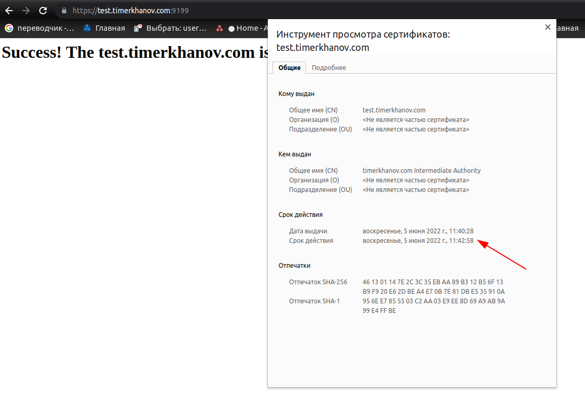
## 10. Поместите скрипт в crontab, чтобы сертификат обновлялся какого-то числа каждого месяца в удобное для вас время.
>Помещаем скрипт в crontab от root (для теста время жизни сертификата 2 миныты - запускаем каждую минуту.):

`* * * * * /root/refresh.sh test.timerkhanov.com 2m >/dev/null 2>&1`
>Проверяем результат работы:
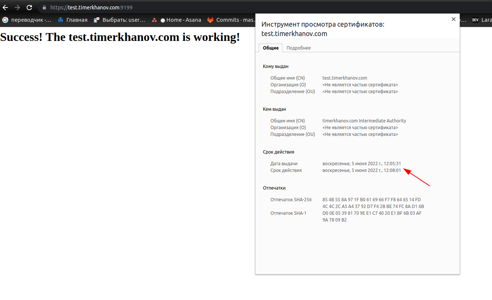

> Через минуту, после запуска cron:

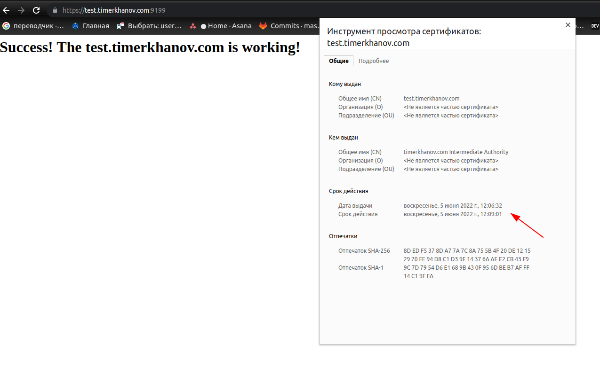

>Изменим crontab, чтобы каждые 30 дн выпускался сертификат:

`root@vagrant:~# crontab -e`<br>
`* * */30 * * /root/refresh.sh test.timerkhanov.com 720h >/dev/null 2>&1`